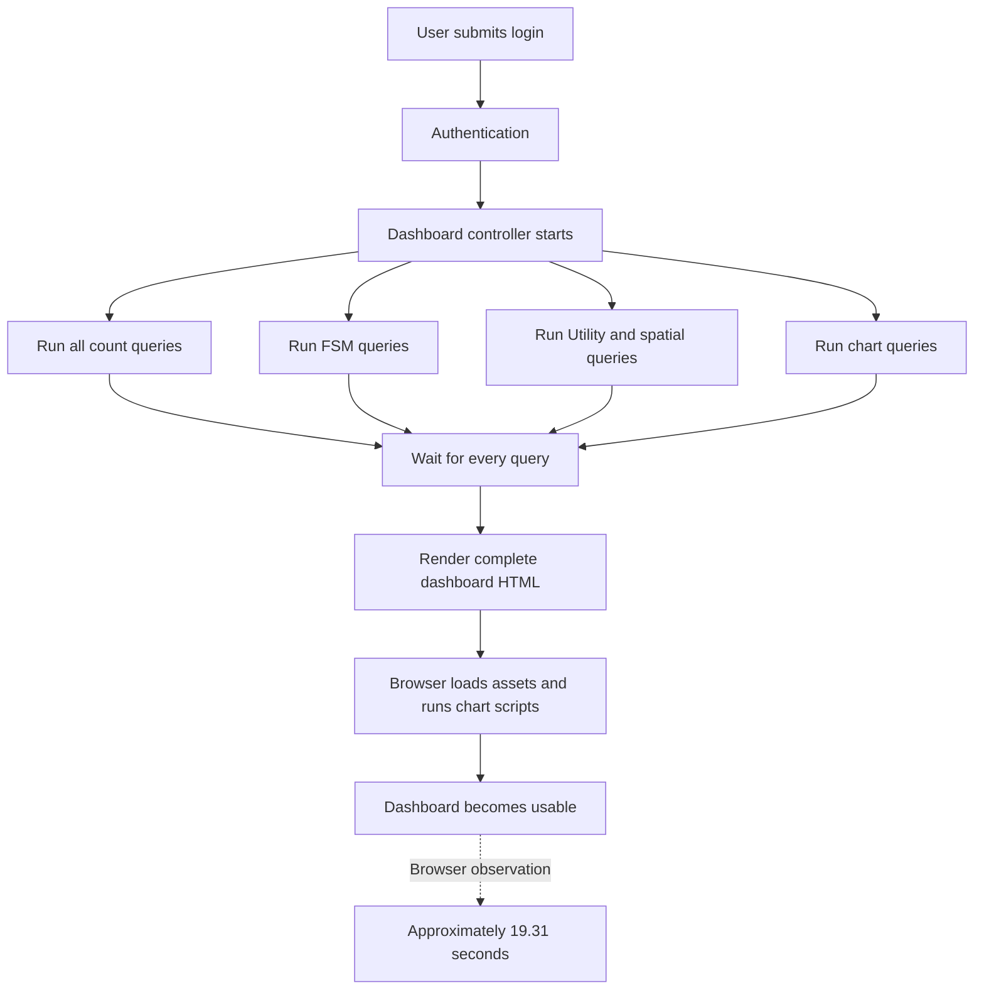
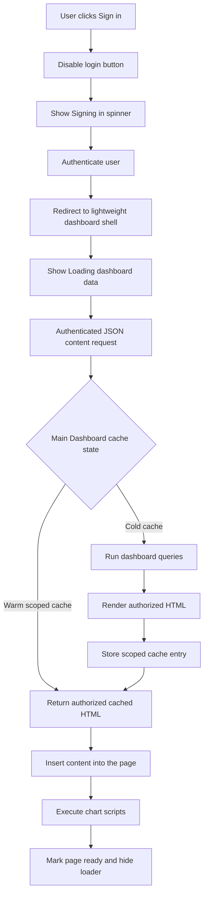
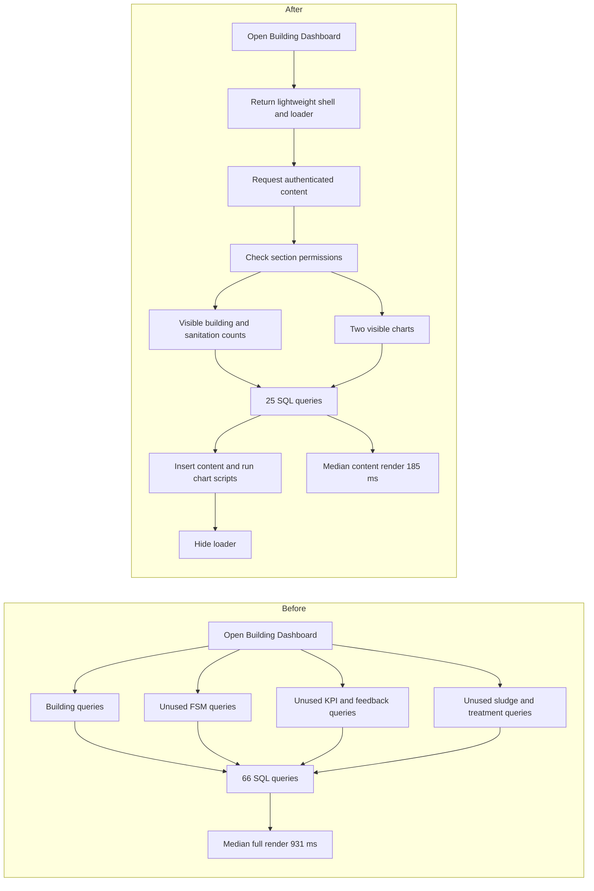
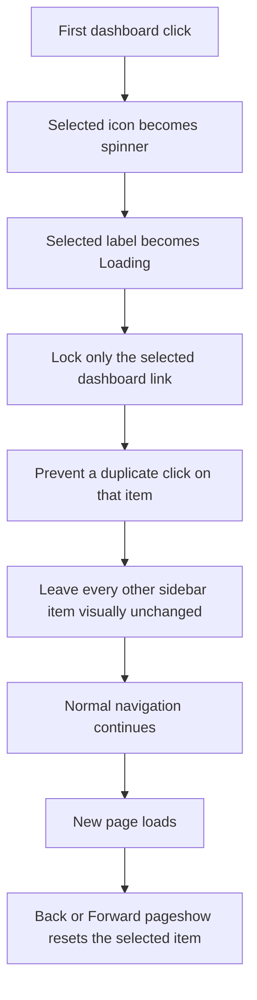

# BASEIMIS-20: Dashboard and Login Optimization — Technical Handoff

**Prepared for:** Technical Lead  
**Prepared on:** 25 August 2026  
**Document type:** Implemented-change report and remaining-work handoff  
**Current status:** Building Dashboard pilot and dashboard loading improvements implemented; FSM and Utility query optimization still in progress/pending

## 1. Executive summary

The original performance investigation found that login completed in approximately **1.48 seconds**, while the main dashboard took approximately **19.31 seconds** to become fully visible in the browser. This showed that authentication was not the main bottleneck. The main delay came from dashboard database queries, server-side rendering, asset/chart initialization, and the absence of visible progress while that work was happening.

The implemented work therefore focused on four areas:

1. preventing duplicate login and dashboard-navigation submissions;
2. displaying a dashboard shell and loading state before expensive dashboard work finishes;
3. introducing authorization-scoped caching for the main IMIS Dashboard;
4. removing unrelated FSM/KPI work from the Building Dashboard.

The controlled Building Dashboard benchmark improved from **66 SQL queries and 931 ms** median full server render to **25 SQL queries and 185 ms** in the first benchmark after implementation. A later verification run recorded **25 queries and 212 ms**, showing that normal run-to-run variation exists while the improvement remains substantial.

This change does **not** mean every dashboard query has already been optimized. The current completion status is documented explicitly below.

## 2. Implementation status by dashboard

| Area | Implemented now | Still required |
|---|---|---|
| Login | Button spinner, “Signing in…” state, disabled submit, duplicate-submit prevention, browser-history reset | Separate security review for validation, rate limiting, throttling and audit behaviour |
| Main IMIS Dashboard | Lightweight shell, asynchronous authenticated content request, scoped cache, stale refresh, mutation invalidation, loader/error/retry/session handling | Repeat production cold/warm measurements and continue SQL-level optimization where required |
| Building Dashboard | Unused FSM/KPI work removed, permission checks moved before group queries, lightweight shell and page loader added, authenticated content endpoint added, chart scripts executed after insertion, tests added | Optional consolidation of remaining equivalent service methods after parity tests |
| Utility Dashboard | Lightweight shell and page-level loader, authenticated JSON content endpoint, shared loader behaviour, chart-script execution after insertion | Query consolidation, permission-before-query execution, category-boundary corrections, soft-delete consistency, drain spatial-query correction, scoped cache if approved |
| FSM Dashboard | Sidebar navigation loader and duplicate-click protection | Controller/query cleanup, permission-before-query execution, service consolidation, asynchronous group loading and tests |
| CWIS Dashboard | Sidebar navigation loader and duplicate-click protection | No query optimization performed in this work |
| KPI Dashboard | Sidebar navigation loader and duplicate-click protection | No query optimization performed in this work |

## 3. Before optimization

Previously, opening the main dashboard blocked on the complete dashboard controller. The browser received useful dashboard HTML only after every count, chart and spatial query finished.



Main problems in this flow:

- no immediate dashboard feedback after login;
- repeated clicks could submit login or navigation again;
- slow queries blocked the whole page;
- hidden or unrelated Building sections were still calculated;
- repeat dashboard requests could repeat the same expensive work;
- chart scripts were tightly coupled to the original full-page lifecycle.

## 4. Current implemented flow

The main IMIS Dashboard, Building Dashboard and Utility Dashboard now return a lightweight shell first. The browser then requests dashboard content separately.



For Building and Utility, the same shell/loading/error mechanism is used, but result caching has not yet been enabled for these two dashboards. Their data requests run in the background while the user sees the loader.

## 5. Technical changes implemented

### 5.1 Login duplicate-submit guard

The login form now has a controlled submission state:

- native form validation runs first;
- the first valid submission marks the form as submitting;
- the submit button is disabled;
- the button displays a spinner and “Signing in…”;
- subsequent submissions are prevented;
- the state resets on `pageshow` for browser Back/Forward cache behaviour.

Primary file:

- `resources/views/auth/login.blade.php`

This is a user-experience and duplicate-request improvement. It does not replace server-side authentication throttling or validation.

### 5.2 Main Dashboard asynchronous response

The main route now returns only the page shell. A second authenticated endpoint returns a JSON contract containing the authorized dashboard HTML.

Routes:

- `GET /dashboard`
- `GET /dashboard/content`

The content endpoint:

- requires authentication;
- returns `{ status, html, meta }` JSON;
- reports cache hit/miss metadata;
- uses `Cache-Control: private, no-store` for the HTTP response;
- returns a controlled JSON error and logs unexpected failures;
- redirects the browser to login when the asynchronous request receives `401` or `419`.

Primary files:

- `app/Http/Controllers/HomeController.php`
- `routes/web.php`
- `resources/views/dashboard/indexAdmin.blade.php`
- `resources/views/dashboard/_content.blade.php`
- `resources/views/dashboard/_asyncDashboardLoader.blade.php`

### 5.3 Shared loading, error and retry component

The main and Utility dashboards reuse one loading component. It provides:

- an accessible loading message;
- `aria-busy` state on the content container;
- authenticated same-origin fetch;
- JSON contract validation;
- login redirection on session expiry;
- a visible error state and Retry button;
- dynamic execution of chart scripts after HTML insertion;
- compatibility for existing chart code that waits for `DOMContentLoaded`;
- reliable loader removal through Bootstrap's `d-none` class.

The `d-none` change fixed a specific defect where Bootstrap's `d-flex` used `display: flex !important`, causing the old loading banner to remain visible even after charts appeared.

Primary file:

- `resources/views/dashboard/_asyncDashboardLoader.blade.php`

### 5.4 Main Dashboard cache design

The main dashboard uses Laravel's cache abstraction, so the same code can work with supported file, database or Redis drivers.

Current timing configuration:

- fresh TTL: **180 seconds (3 minutes)**;
- stale authorized response retention: **1,800 seconds (30 minutes)**;
- stale responses are refreshed after the HTTP response;
- a cache lock prevents multiple workers refreshing the same entry simultaneously.

The cache key currently includes:

- dashboard data version;
- user ID;
- service-provider ID;
- treatment-plant ID;
- sorted roles;
- sorted effective permissions;
- locale;
- selected filters.

User ID remains the final isolation boundary. If the application later allows one user to switch an additional municipality/entity scope without changing these values, that scope must be added explicitly to the key.

Dashboard-source model events (`saved`, `deleted`, and `restored`) increment a namespace version. Old entries become unreachable and expire naturally. This approach works without wildcard deletion and is portable across cache drivers.

Primary files:

- `app/Services/DashboardService.php`
- `app/Providers/AppServiceProvider.php`
- `config/dashboard.php`
- `tests/Unit/DashboardServiceCacheTest.php`

### 5.5 Sidebar permission-query reduction

The sidebar repeatedly checks permission groups. These groups are now loaded once per authenticated user instance during the request and reused for subsequent sidebar checks.

Primary file:

- `app/Models/User.php`

### 5.6 Building Dashboard query cleanup

The Building Dashboard view displays only:

- building count boxes;
- sanitation-system count boxes;
- buildings-per-ward chart;
- building-use composition chart.

The old controller also calculated FSM applications, emptying services, sludge collection, providers, treatment plants, feedback, PPE, containment charts, future-emptying charts, sewer data, hotspots and KPIs. Those values were not displayed by the Building view.

The optimized controller now:

- returns a lightweight page shell before starting the dashboard queries;
- exposes an authenticated JSON content endpoint for the permitted Building content;
- calculates only the visible Building sections;
- checks each section permission before running its queries;
- does not pass unrelated FSM/KPI data to the view;
- removes unused Building year-selector JavaScript;
- inserts the returned content and executes its chart scripts before hiding the loader;
- preserves authentication middleware and the visible data contract.

Primary files:

- `app/Http/Controllers/BuildingInfo/BuildingDashboardController.php`
- `resources/views/dashboard/buildingDashboardShell.blade.php`
- `resources/views/dashboard/buildingDashboard.blade.php`
- `resources/views/dashboard/_asyncDashboardLoader.blade.php`
- `routes/web.php`
- `tests/Feature/BuildingDashboardOptimizationTest.php`

## 6. Building Dashboard before/after result



| Measurement | Before | First after-result | Improvement |
|---|---:|---:|---:|
| SQL query count | 66 | 25 | 62% fewer |
| Median full server render | 931.10 ms | 185.24 ms | 80% faster |
| Median database time | 881.58 ms | 136.63 ms | 84% lower |

A later controlled run recorded 25 queries and approximately 212 ms full render. Performance must always be interpreted across repeated runs using the same role, dataset, filters and cache state.

Building routes:

- `GET /building-info/buildings/buildingdashboard` — lightweight shell;
- `GET /building-info/buildings/buildingdashboard/content` — authenticated JSON/HTML content.

## 7. Utility Dashboard loading change

Utility was the slowest secondary dashboard in the original controlled local benchmark: approximately **2.54 seconds**, **73 SQL queries**, and approximately **2.47 seconds database time**.

The current change improves perceived behaviour without claiming the SQL work is complete:


Routes:

- `GET /utilityinfo/utilitydashboard`
- `GET /utilityinfo/utilitydashboard/content`

Primary files:

- `app/Http/Controllers/UtilityInfo/UtilityDashboardController.php`
- `resources/views/dashboard/utilityDashboardShell.blade.php`
- `resources/views/dashboard/utilityDashboard.blade.php`
- `routes/web.php`
- `tests/Feature/UtilityDashboardLoadingTest.php`

The remaining Utility optimization should reduce its queries rather than treating the loader as the final performance solution.

## 8. Sidebar duplicate-navigation protection

All sidebar dashboard destinations are marked for protected navigation:

- Main Dashboard;
- Building Dashboard;
- FSM Dashboard;
- Utility Dashboard;
- CWIS Dashboard;
- KPI Dashboard.

After the first normal click:



Modified-click behaviour such as Ctrl-click, Command-click, Shift-click and middle-click is left unchanged so users can intentionally open a dashboard in another tab.

The earlier sidebar-wide blocking overlay was removed because it covered unrelated menu items and could overlap dashboard content. Loading state is now owned by the clicked dashboard link only. The selected icon and label change while that item is protected from duplicate clicks; unrelated sidebar entries are not darkened, renamed or disabled.

Primary file:

- `resources/views/includes/sidebar.blade.php`

## 9. Authorization and data-leakage controls

The following controls are currently implemented for the main dashboard:

- authentication is required for shell and content routes;
- cache keys include user identity and effective authorization information;
- authorized HTML is rendered only after the scoped key is created;
- cached content is not shared only by a broad role name;
- HTTP responses are private and not stored by shared browser/proxy caches;
- session-expired asynchronous calls do not silently insert login HTML as chart data;
- a lock limits duplicate cache refresh work.

Important remaining review item:

- Utility and FSM controllers still need permission checks moved before all data resolution. Blade `@can` controls what is displayed, but query execution should also be skipped for unauthorized groups.

## 10. Tests completed

The latest complete automated test run passed **11 tests**.

Implemented coverage includes:

- cache key changes across user and data scopes;
- cached data reuse and invalidation;
- authorized HTML cache isolation;
- Building lightweight loading shell;
- Building authenticated JSON/HTML content contract;
- Building shell and content authentication;
- clicked-dashboard-only loading and duplicate-click protection;
- absence of the former sidebar-wide loading overlay;
- Utility lightweight loading shell;
- Utility authenticated JSON/HTML contract;
- Utility shell and content authentication;
- sidebar dashboard-link coverage and loader/lock markup.

Commands used:

```text
php artisan view:cache
php artisan test
php scripts/benchmark_secondary_dashboards.php
```

## 11. QA scope

QA should verify the following with representative roles and scopes.

### Login

- valid login shows “Signing in…” and submits once;
- repeated clicks do not send multiple requests;
- invalid native form input does not leave the button disabled;
- browser Back restores the normal login button;
- authentication success, failure and lockout behaviour remain correct.

### Main Dashboard

- shell and loading message appear before content;
- all permitted cards and charts eventually render;
- the loading message disappears after insertion;
- no chart remains blank because its script ran before insertion;
- a failed content request shows Retry;
- expired session redirects to login;
- cold-cache and warm-cache responses contain identical authorized values;
- users with different permissions/provider/plant scope never receive one another's cached dashboard;
- a source data change invalidates the old dashboard namespace.

### Building Dashboard

- shell and loading message appear immediately;
- the content endpoint returns only after permitted Building queries finish;
- displayed counts match the pre-change approved values;
- sanitation cards and both charts render;
- loader disappears only after content insertion and chart-script execution;
- error and Retry states work;
- hidden sections do not execute or appear;
- response timing and SQL count are recorded under the same baseline conditions.

### Utility Dashboard

- shell and loader appear promptly;
- count boxes and every permitted Utility chart appear after the data response;
- loader disappears only after successful insertion;
- error, Retry and session-expiry states work;
- repeated sidebar clicks do not create additional navigation;
- existing values are compared before any upcoming SQL rewrite.

### Sidebar

- all six dashboard links show protected navigation;
- first click shows the selected spinner and Loading label;
- only the clicked dashboard item shows a spinner and Loading label;
- the clicked item cannot be submitted repeatedly;
- unrelated sidebar items do not show loading, become darkened or get covered;
- no loading overlay covers dashboard content in expanded or collapsed mode;
- browser Back/Forward restores the sidebar;
- modified clicks intended for a new tab still work.

## 12. Remaining technical work

The next coding sequence should be:

1. write output-parity tests for FSM and Utility business rules;
2. move authorization checks before their query execution;
3. consolidate repeated count queries into conditional aggregates;
4. correct Utility range boundaries and soft-delete inconsistencies;
5. replace the drain Cartesian spatial calculation with an `ST_Intersects` join;
6. verify existing GiST indexes through execution plans instead of adding duplicate indexes;
7. consolidate equivalent service methods into the existing `DashboardService` only after parity tests pass;
8. decide which FSM/Utility groups require caching and add every effective scope dimension to their keys;
9. remeasure cold cache, warm cache, first useful content and complete dashboard time in the target environment;
10. review login validation, rate limits, throttling, intended redirects and audit events separately.

## 13. Short explanation for the technical lead

> The baseline showed that login itself was around 1.48 seconds, but the dashboard took around 19.31 seconds, so the primary bottleneck was dashboard processing. I separated the main, Building and Utility pages into lightweight shells and authenticated content requests so users receive immediate loading feedback. For the main dashboard, I added authorization-scoped Laravel caching with a three-minute fresh period, stale background refresh, locking and model-event invalidation. I optimized the Building Dashboard by removing FSM and KPI queries that its view never displayed and by checking permissions before section queries. That reduced the controlled Building result from 66 to 25 queries and from roughly 931 ms to 185 ms median server render. I also added duplicate-submit protection on login. Each dashboard link now shows its own loading spinner after it is clicked and prevents a duplicate click on that item without covering or changing the rest of the sidebar. The next work is the actual FSM and Utility SQL/query consolidation; their loaders improve user feedback but do not replace backend optimization.

## 14. Review decisions requested

The technical lead should confirm:

- whether the three-minute main-dashboard freshness target is acceptable for every current widget;
- whether stale-while-refresh should remain enabled in production;
- whether one user can switch municipality/entity scope without changing identity, provider or plant, requiring another explicit cache-key dimension;
- the approved boundary definitions for Utility width and diameter categories;
- the implementation order between Utility SQL correction and FSM query/service consolidation;
- whether Redis will be the production Laravel cache driver after infrastructure validation.
