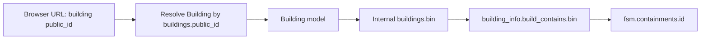
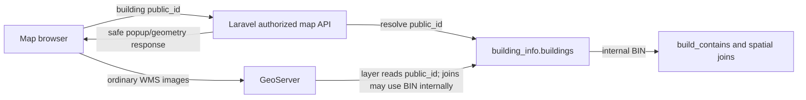

                                      

# Building Module URL-Binding Study

## 1. Purpose

This document reviews UUID URL binding specifically for the Building module, following the existing Feedback pattern in this repository. It covers the large `building_info.buildings` table, Building-facing URLs, and the `building_info.build_contains` link between buildings and containments.

This is a design and impact study only. It does not implement the change.

## 2. Recommended identity design

| Concern                                | Identifier                                                        |
| -------------------------------------- | ----------------------------------------------------------------- |
| Building database primary/business key | `buildings.bin` — unchanged                                    |
| Building URL identifier                | new`buildings.public_id` UUID                                   |
| Building-to-containment join           | `build_contains.bin -> buildings.bin` — unchanged              |
| Containment join                       | `build_contains.containment_id -> containments.id` — unchanged |
| Operational UI/report field            | BIN may remain visible when authorized and required               |

Do not replace BIN inside `build_contains`, owners, applications, toilets, sewers, or other internal relationships as part of URL binding. Resolve the external UUID to a Building at the HTTP/controller boundary, then continue using its BIN internally.



Example:

```text
URL value: 8ed9476e-f932-47af-81de-1e60bc39a503

Resolved Building:
public_id = 8ed9476e-f932-47af-81de-1e60bc39a503
bin       = B000123

Existing pivot lookup:
building_info.build_contains.bin = B000123
```

## 3. Why BIN must remain the internal key

The Building model maps to `building_info.buildings` and declares BIN as its non-incrementing primary key at `app/Models/BuildingInfo/Building.php:23-25`.

BIN is used by:

- containment pivot: `Building.php:32-36`;
- shared/community-toilet pivots: `Building.php:39-42` and 98-100;
- owner relation: `Building.php:45-47`;
- applications: `Building.php:61-62`.

The reverse Containment relationship uses `build_contains.containment_id` and `build_contains.bin` at `app/Models/Fsm/Containment.php:24-27`. The pivot model has its own `id` primary key at `app/Models/BuildingInfo/BuildContain.php:14-15`.

Changing BIN would therefore be a core data-model migration. Adding a separate `public_id` is the lower-risk URL-binding change.

## 4. Review of the existing Feedback method

The Feedback implementation is the project precedent.

### What it does correctly

1. Adds UUID `public_id` without replacing the internal primary key: `database/migrations/2026_07_22_000001_add_public_id_to_fsm_feedbacks_table.php:18-20`.
2. Backfills existing rows: migration lines 22-32.
3. Generates UUIDs for new Eloquent records: `app/Models/Fsm/Feedback.php:29-35`.
4. Generates links/forms with `public_id`: `app/Http/Controllers/Fsm/FeedbackController.php:104-110` and `resources/views/fsm/feedbacks/edit.blade.php:13`.
5. Names the resource parameter clearly: `routes/web.php:434`.
6. Resolves the public identifier before using the record: `FeedbackController.php:141-143`, 179-181, 210-214, 268-270, and 370-372.

The same external-ID/internal-key separation is correct for Building.

### What should not be copied literally for a huge Building table

The Feedback migration:

- creates the unique index immediately with `nullable()->unique()`;
- uses batches of only 100 rows;
- executes one `UPDATE` per row;
- performs the whole backfill inside a deployment migration;
- leaves `public_id` nullable;
- guarantees UUID generation only for Eloquent `creating` events;
- has no discovered URL-binding test coverage.

On a large table this can make deployment time unpredictable, add transaction/WAL pressure, maintain the new index during every backfill update, and make interruption/recovery harder.

## 5. Building binding method

### 5.1 Keep the primary key unchanged

Keep:

```php
protected $primaryKey = 'bin';
public $incrementing = false;
```

Do not make `public_id` the Eloquent primary key. Existing internal `Building::find($bin)` calls and relationships depend on BIN.

### 5.2 Add a URL-only UUID

Add `building_info.buildings.public_id UUID` with the final guarantees:

- non-null for active and soft-deleted Building rows;
- unique and indexed;
- immutable after creation;
- generated by the application and preferably protected by a database default where supported;
- not accepted from ordinary create/update form input.

Use the name `public_id` to match Feedback. “UID” may be used informally, but the stored value and code should consistently be a UUID in `public_id`.

### 5.3 Use Feedback-style manual resolution first

The least disruptive approach is:

```php
private function findByPublicId($publicId)
{
    return Building::where('public_id', $publicId)->firstOrFail();
}
```

Each URL-facing method should:

```text
receive building_public_id
-> validate/resolve Building by public_id
-> authorize the action and record
-> pass the Building model or its bin to existing internal logic
```

This is safer than globally changing `find()` semantics. Merely adding `getRouteKeyName()` would not convert the current untyped `$id` controller parameters into Building models.

For new/refactored code, passing the resolved `Building` model into services is clearest. For a minimal first rollout, resolve the model and pass `$building->bin` to existing services.

The current update service sets `$request->bin = $id` at `app/Services/BuildingInfo/BuildingStructureService.php:379-386`. A UUID must never be passed into this existing `$id` position without first translating it to BIN.

## 6. How `build_contains` works after binding

### 6.1 The pivot table does not need `public_id`

Keep the pivot columns and meanings unchanged:

```text
id
bin
containment_id
deleted_at
...
```

Do not copy `building.public_id` into the pivot. That would duplicate an external identifier, widen pivot indexes, require synchronization, and mix HTTP concerns into the relational model.

### 6.2 Reading a Building's containments

Target flow:

```text
URL contains building_public_id
-> resolve Building by public_id
-> call $building->containments
-> unchanged join: build_contains.bin = building.bin
```

The relationship at `Building.php:32-36` requires no change.

### 6.3 Creating a containment for a Building

Current route:

```text
/fsm/containments/{BIN}/create
```

Recommended target:

```text
/fsm/containments/building/{building_public_id}/create
```

`ContainmentController::createContainment()` currently calls `Building::find($id)` at `app/Http/Controllers/Fsm/ContainmentController.php:97-101`. It should resolve `public_id`. Saving should still pass `$building->bin` and `$containment->id` to `BuildingStructureService::storeBuildContainInfo()`; its current write at lines 310-315 remains correct.

### 6.4 Loading containment data on Building edit

The current AJAX URL embeds BIN at `resources/views/building-info/buildings/edit.blade.php:47`. `ContainmentService::fetchBuildingContainmentData()` then treats `$request->id` as BIN at `app/Services/Fsm/ContainmentService.php:131-145`.

Target flow:

1. AJAX path contains `building_public_id`.
2. Controller resolves the Building.
3. Service receives `$building->bin` explicitly.
4. Pivot query remains `where('bc.bin', $building->bin)`.
5. The generated delete-connection form uses `$building->public_id` in its URL.

The service should no longer treat a generic request `id` as both an external route identifier and an internal BIN.

### 6.5 Deleting a Building-containment connection

Current route at `routes/web.php:366`:

```text
DELETE /fsm/containments/{containment_id}/buildings/{BIN}
```

Building-focused target:

```text
DELETE /fsm/containments/{containment_id}/buildings/{building_public_id}
```

The controller should resolve the Building, verify the active pivot belongs to both records, and then soft-delete using:

```text
bin = building.bin
containment_id = containment.id
```

The existing BIN-based pivot operations in `app/Http/Controllers/Fsm/ContainmentController.php:308-360` remain valid after this initial resolution.

If Containment later gets its own `public_id`, the URL can use both public identifiers. That is a separate Containment-module rollout.

### 6.6 When the pivot would need its own UUID

Only add `build_contains.public_id` if the connection becomes a first-class URL resource, such as:

```text
/building-containment-connections/{connection_public_id}
```

The current application addresses the connection by its Building and Containment, so a pivot UUID is unnecessary.

## 7. Core Building URL changes

Current routes are defined at `routes/web.php:88-99`.

| Current effective route                                 | Target path value        |
| ------------------------------------------------------- | ------------------------ |
| `GET /building-info/buildings/{BIN}`                  | `{building_public_id}` |
| `GET /building-info/buildings/{BIN}/edit`             | `{building_public_id}` |
| `PATCH /building-info/buildings/{BIN}`                | `{building_public_id}` |
| `DELETE /building-info/buildings/{BIN}`               | `{building_public_id}` |
| `GET /building-info/buildings/{BIN}/history`          | `{building_public_id}` |
| `GET /building-info/buildings/{BIN}/listContainments` | `{building_public_id}` |

Resolution changes are required in:

- `BuildingController::show()` — lines 191-195;
- `edit()` — lines 228-232;
- `update()` — lines 341-344;
- `history()` — lines 345-348;
- `destroy()` — lines 361-364;
- `listContainments()` — lines 401-403.

`BuildingStructureService::fetchData()` must select `buildings.public_id` along with BIN at `app/Services/BuildingInfo/BuildingStructureService.php:969-985`, then generate action URLs/forms with `public_id` at lines 1048-1074. BIN can remain a visible DataTable business column; `public_id` need not be displayed.

Other direct consumers:

- edit update form: `resources/views/building-info/buildings/edit.blade.php:9-11`;
- edit containment AJAX: line 47;
- index containment AJAX: `resources/views/building-info/buildings/index.blade.php:601`;
- add-containment link: `resources/views/building-info/buildings/partial-form.blade.php:640`.

## 8. What should and should not change

| Use                                                          | Decision                                   |
| ------------------------------------------------------------ | ------------------------------------------ |
| Building CRUD/history/list-containments path                 | Replace BIN with`public_id`              |
| Operational BIN form/display field                           | Keep if business-required and authorized   |
| Select2 option used only to identify a Building              | Prefer`public_id`; translate server-side |
| `get-sanitation-system?bin=...` lookup                     | Prefer`building_public_id`               |
| Internal`build_contains`, owner, application, toilet joins | Keep BIN                                   |
| Authorized report/export BIN column                          | Policy decision, not URL binding           |

## 9. Connected Building-addressing surfaces

A Building rollout should also review:

1. **Containments:** create, containmentData, connection list, and connection delete described above.
2. **Sewer connection:** BIN paths at `routes/web.php:191-192`; resolve Building UUID, then retain internal BIN queries in `app/Services/SewerConnection/SewerConnectionService.php:82-142`.
3. **Maps:** links with `field=bin&val={BIN}` at `BuildingStructureService.php:1071-1074`; Building-specific endpoints should accept UUID and translate to BIN internally.
4. **Application/CT-PT selectors:** where the browser value only identifies a Building, return `public_id` as the option ID and translate before writing legacy BIN columns.
5. **House images:** `/storage/emptyings/houses/{BIN}.jpg` is outside Laravel route binding and needs protected delivery or opaque filenames separately.
6. **GeoServer/WFS:** Laravel cannot hide BIN in direct WFS properties or CQL filters; layer security/design is separate.

## 10. Map page and GeoServer communication

### 10.1 Current communication paths

The map page currently communicates in two ways:

1. **Browser directly to GeoServer**
   - GeoServer URL, workspace, WMS/WFS URLs, and `authkey` are written into page JavaScript at `resources/views/maps/index.blade.php:1954-1962`.
   - OpenLayers creates direct WMS sources at lines 3008-3017.
   - Direct WFS requests are constructed in the browser, for example lines 4003-4006 and 11087-11089.
   - GetFeatureInfo/property responses are used to build the popup, including a BIN-based Building edit link at lines 9893-9901.
2. **Browser to Laravel, then Laravel to the database/service**
   - autocomplete calls `/maps/search-auto-complete/...` at lines 1822-1835;
   - Building search calls `/maps/search-building/{field}/{val}` at lines 10632-10635;
   - Laravel queries `building_info.buildings` in `app/Http/Controllers/MapsController.php:793-829`;
   - Laravel map services perform additional BIN/pivot/spatial queries.

URL binding must cover both paths. Updating Laravel Building routes alone will not stop direct GeoServer WFS/GetFeatureInfo responses from returning BIN.

### 10.2 Recommended hybrid architecture

Use this division:

| Map operation                                 | Recommended communication                                        |
| --------------------------------------------- | ---------------------------------------------------------------- |
| Normal city-wide WMS layer rendering          | Browser -> GeoServer directly                                    |
| Search autocomplete                           | Browser -> Laravel                                               |
| Open/zoom to one Building from a UUID URL     | Browser -> Laravel, or GeoServer filtered by`public_id`        |
| Building popup/detail attributes              | Prefer Browser -> Laravel authorized endpoint                    |
| Sensitive WFS data and owner/payment exports  | Browser -> Laravel proxy/export controller -> GeoServer/database |
| Internal spatial joins involving containments | Laravel/GeoServer SQL uses BIN internally                        |

This keeps high-volume map-image rendering efficient while placing record-level authorization and sensitive attributes behind Laravel.



### 10.3 Make `public_id` available to the GeoServer Building layer

After adding and backfilling `buildings.public_id`, update or refresh the GeoServer `buildings_layer` feature type so the layer can read that column.

If `buildings_layer` is based on a database view rather than the table, add `b.public_id` to the view. The view may continue joining other tables through `b.bin`; only the externally exposed identifier changes.

Conceptual view:

```sql
SELECT
    b.public_id,
    b.bin, -- retain internally or expose only when explicitly authorized
    b.house_number,
    b.ward,
    b.geom,
    ...
FROM building_info.buildings b
LEFT JOIN building_info.build_contains bc ON bc.bin = b.bin
...
```

The unique `buildings.public_id` index benefits both Laravel lookup and a GeoServer filter such as:

```text
CQL_FILTER=public_id='8ed9476e-f932-47af-81de-1e60bc39a503'
```

GeoServer should treat `public_id` as the external feature identifier used by application filters. BIN can remain inside the SQL view for joins without being returned as a default WFS property.

After the schema/view update:

- refresh/reload the GeoServer feature type;
- confirm `public_id` is recognized as UUID/string-compatible in CQL;
- update configured layer attributes/property exposure;
- inspect SLD styles and SQL views for any BIN assumptions;
- test GetMap, GetFeatureInfo, and WFS output separately.

### 10.4 Opening a Building from a UUID URL

Recommended application flow:

```text
/maps/buildings/{building_public_id}
-> Laravel resolves Building by public_id
-> Laravel authorizes map access
-> response supplies public_id plus safe geometry/extent
-> OpenLayers zooms/highlights the result
```

Two rendering choices are valid:

**Choice A — Laravel returns geometry/extent.** This provides the strongest record-level control and avoids exposing an internal GeoServer filter. The current `searchBuilding()` response can be redesigned to accept only `building_public_id`, query with a bound parameter, and return `public_id`, safe display fields, and GeoJSON/extent—never a client-selected database column.

**Choice B — GeoServer WMS filters by `public_id`.** Laravel can return only the validated UUID, and OpenLayers can update the Building layer with a CQL filter on `public_id`. This is efficient for drawing, but GeoServer must enforce its own access policy because the browser can alter the request.

For a single selected Building, a small vector highlight returned by Laravel is often simpler than creating a high-cardinality WMS cache entry for every UUID.

### 10.5 Search and autocomplete behavior

The current UI lets the user select `bin` as a database field at `resources/views/maps/index.blade.php:81-84`, and Laravel accepts a client-provided field at `app/Http/Controllers/MapsController.php:793-804`.

Recommended behavior:

- users may still type/search a BIN or house number as operational search text;
- Laravel performs the authorized lookup internally;
- search results return `public_id` as the record identifier;
- the browser uses `public_id` for subsequent zoom, popup, edit, or share actions;
- do not place the searched BIN into a path URL;
- do not allow arbitrary client-supplied database column names.

Example response:

```json
{
  "public_id": "8ed9476e-f932-47af-81de-1e60bc39a503",
  "label": "B000123 / House 24",
  "geometry": { "type": "Polygon", "coordinates": [] }
}
```

BIN may be included in the display label if the user's permission and business workflow allow it, but it is not the navigation key.

### 10.6 Popup and edit-link behavior

The current Building popup reads `bin` from GeoServer properties and builds `/building-info/buildings/{BIN}/edit` at `resources/views/maps/index.blade.php:9893-9901`.

Target behavior:

```text
popup feature carries public_id
-> edit link uses /building-info/buildings/{public_id}/edit
```

Preferred secure popup flow:

1. GeoServer/GetFeatureInfo provides only `public_id` and non-sensitive cartographic fields.
2. When the user opens detailed information, JavaScript calls a Laravel endpoint using `public_id`.
3. Laravel resolves and authorizes the Building.
4. Laravel returns only fields allowed for that user.

This avoids treating a GeoServer property list as the application authorization layer.

### 10.7 `build_contains` and GeoServer

GeoServer views and spatial reports can continue joining:

```text
buildings.bin = build_contains.bin
build_contains.containment_id = containments.id
```

No UUID is required in `build_contains`. When a request starts with `building_public_id`, either:

- Laravel resolves UUID to BIN before running the existing spatial/pivot query; or
- a GeoServer SQL view begins from `buildings.public_id`, then performs internal BIN joins.

Example conceptual GeoServer view:

```sql
SELECT b.public_id, c.id AS containment_id, b.geom
FROM building_info.buildings b
JOIN building_info.build_contains bc
  ON bc.bin = b.bin AND bc.deleted_at IS NULL
JOIN fsm.containments c
  ON c.id = bc.containment_id AND c.deleted_at IS NULL;
```

The externally filterable field is `public_id`; the internal join remains BIN.

### 10.8 WFS exports and sensitive attributes

The map currently asks GeoServer for BIN together with owner/contact/payment attributes, including:

- general Building property list at `resources/views/maps/index.blade.php:11120-11124`;
- tax-status export at line 11456;
- water-payment export at line 11527;
- SWM-payment export at line 11593.

For ordinary map feature responses, replace BIN as the feature identifier with `public_id` and reduce `PROPERTYNAME` to the minimum necessary fields.

For authorized operational exports that legitimately require BIN, keep BIN as an export column but generate the export through an authorized Laravel endpoint. URL binding is not a reason to remove BIN from every business report; it is a reason not to use BIN as the public navigation key.

### 10.9 GeoServer authentication boundary

`AUTH_KEY` is rendered into browser JavaScript at `resources/views/maps/index.blade.php:1962`, and another direct WFS URL contains a hard-coded auth key at line 4005. Any value delivered to browser JavaScript must be treated as observable by the user, not as a server secret.

Recommended controls:

- ordinary public/low-sensitivity WMS layers may use a narrowly scoped GeoServer access mechanism;
- sensitive WFS, owner/contact/payment properties, and exports should go through Laravel or a properly authenticated GeoServer session with layer-level permissions;
- keep GeoServer service credentials server-side;
- allow-list workspace, layer, operation, properties, and filters in any Laravel proxy;
- do not create an unrestricted proxy that forwards arbitrary WFS URLs/CQL from the browser;
- separately rate-limit expensive spatial/export operations.

### 10.10 Map migration sequence

1. Add/backfill/index `buildings.public_id`.
2. Add `public_id` to the GeoServer Building table/view and refresh the layer.
3. Confirm direct WMS rendering still works with no BIN URL change.
4. Change Laravel search/autocomplete results to return `public_id` as the identifier.
5. Change map-open/highlight URLs and AJAX calls to use `building_public_id`.
6. Change popup edit/detail links to use `public_id`.
7. Remove BIN from default WFS/GetFeatureInfo property lists where it is not operationally required.
8. Move sensitive popup/export requests behind authorized Laravel endpoints.
9. Retest Building-containment spatial flows while keeping BIN joins internal.
10. Remove old `field=bin&val={BIN}` navigation after compatibility monitoring.

### 10.11 Map-specific tests

- City-wide Building WMS renders before and after the schema change.
- UUID map link selects, zooms, and highlights exactly one Building.
- BIN is not present in the shareable map URL.
- Searching by BIN can display an authorized result but subsequent navigation uses `public_id`.
- Popup edit/detail links use `public_id`.
- An unknown/malformed UUID returns no feature/404 without a database error.
- GetFeatureInfo/WFS does not return BIN, owner, contact, or payment fields beyond the user's permission.
- Building-containment visualization returns the same relationship results through internal BIN joins.
- Direct GeoServer requests cannot bypass application restrictions for sensitive layers.
- GeoServer uses the `public_id` index for single-Building filters.

## 11. Large-table rollout

Use an expand/backfill/validate/switch approach rather than one large deployment migration.

### Phase A — add a nullable column

Add `public_id uuid NULL` without the final unique constraint. Adding a nullable column without a volatile default is normally the lowest-lock first step; confirm against the production PostgreSQL version.

### Phase B — generate UUIDs for new rows

Add the same Eloquent `creating` behavior used by Feedback. The identified creation path uses `new Building()` at `app/Services/BuildingInfo/BuildingStructureService.php:49-52`, so the hook covers it.

For imports, scripts, or future raw SQL, a database default such as `gen_random_uuid()` is stronger, but only after confirming the required PostgreSQL function/extension exists.

### Phase C — resumable backfill

Use a separate command or operations runbook that:

- updates only `public_id IS NULL` rows;
- processes bounded batches ordered by the existing BIN primary key;
- commits after every batch;
- is idempotent and restartable;
- records progress/rate;
- reduces load when replication lag, WAL, locks, or latency rises.

If `gen_random_uuid()` exists, use set-based batch updates rather than one update per Eloquent model. Test batch size with production-like data instead of copying Feedback's fixed batch of 100.

Monitor null count, duplicates, CPU/I/O, WAL/replica lag, dead tuples/autovacuum, locks, and request latency.

### Phase D — unique index

Build the final lookup index with PostgreSQL concurrent index creation when uptime requires it:

```sql
CREATE UNIQUE INDEX CONCURRENTLY buildings_public_id_unique
ON building_info.buildings (public_id);
```

Concurrent index creation cannot run inside a normal PostgreSQL transaction. Use a non-transactional migration or controlled operations step and handle an invalid index left by interruption.

With this index, `where('public_id', $uuid)->firstOrFail()` is an indexed point lookup even when the table is very large.

### Phase E — validate and enforce non-null

Verify:

```text
rows where public_id is null = 0
total rows = distinct public_id rows
```

Then enforce non-null using a production-safe method for the deployed PostgreSQL version, potentially a validated `CHECK (public_id IS NOT NULL)` before setting `NOT NULL` to minimize re-scan/locking.

### Phase F — switch URLs

Deploy route, controller, service-boundary, DataTable, Blade, AJAX, and connected-module changes only after every Building row has an indexed UUID.

Avoid mixed application versions where one server emits UUID URLs that another interprets as BIN.

### Phase G — retire legacy BIN URLs

If a temporary legacy redirect is necessary, authorize it, redirect to the canonical UUID URL, log usage, and set a removal date. Indefinitely accepting both identifiers preserves enumeration.

## 12. Performance and storage impact

Normal request flow adds one indexed UUID lookup, after which all current BIN relationships continue unchanged. Pass the resolved model through the flow to avoid repeated UUID lookups.

Every Building row gains a 16-byte UUID plus row and B-tree index overhead. Measure disk, backup, and replication headroom before rollout.

UUID v4 matches Feedback and is a reasonable compatibility choice. Random UUIDs have less B-tree insertion locality than time-ordered identifiers, but changing the project standard to UUID v7 or ULID should be a separate, deliberate decision rather than a Building-only variation.

## 13. Authorization

UUIDs reduce guessing but do not replace authorization.

After resolving a Building, each endpoint still needs feature/object authorization. The Building controller assigns permissions to standard CRUD actions, but helper methods are not all named in those lists at `app/Http/Controllers/BuildingInfo/BuildingController.php:50-58`. Connected sewer and map endpoints also need review.

Required order:

```text
validate UUID shape
-> resolve Building or return 404
-> authorize action/object
-> execute internal BIN-based logic
```

## 14. Suggested work packages

1. **Database readiness:** nullable column, new-row generation, resumable backfill, concurrent unique index, validation, non-null enforcement.
2. **Core Building URLs:** CRUD, history, list-containments, DataTable actions, forms/AJAX, permissions, tests.
3. **Building/Containment boundary:** create containment, containmentData, list/delete connection, UUID-to-BIN translation.
4. **Remaining integrations:** sewer, maps, selectors, APIs/mobile compatibility, house images, GeoServer/WFS.

## 15. Test matrix

### Database

- Existing, soft-deleted, and new Buildings have unique non-null UUIDs.
- Backfill stops/restarts without changing completed UUIDs.
- Every supported Building creation path generates a UUID.
- UUID lookup uses the unique index.

### Core routes

- Valid UUID opens the correct show/edit/history record.
- BIN in a converted route returns 404 or a temporary controlled redirect.
- Unknown/malformed UUID returns 404 without SQL errors.
- Update/delete act on the resolved Building's BIN record.
- Generated path URLs do not use BIN.

### `build_contains`

- A Building UUID lists the same containments as the former BIN URL.
- Creating a containment stores the resolved Building's BIN in the pivot.
- Delete soft-deletes only the row matching both Building BIN and containment ID.
- One Building UUID cannot remove another Building's connection.
- Shared containments and multiple-building relationships still work.
- Soft-deleted pivot rows remain excluded.

### Connected modules and security

- Sewer and map Building lookups translate UUID correctly.
- Selectors submit the intended identifier while persistence still writes BIN where required.
- UUID knowledge never bypasses permissions.
- Changing one valid UUID to another does not grant horizontal access.
- House-image and GeoServer paths do not retain unintended BIN bypasses.

## 16. Rollback

Application routing can be rolled back to BIN while retaining `public_id`. This is safer than dropping UUIDs already issued in URLs.

Do not make the migration `down()` operation the first production rollback after UUID URLs are released. Dropping `public_id` would invalidate bookmarks, integrations, logs, and queued work containing UUIDs.

## 17. Final recommendation

Follow the existing Feedback concept—UUID `public_id`, generate on create, send `public_id` in URLs, and resolve it in controllers—with two Building-specific adjustments:

1. use a staged, resumable, concurrently indexed backfill suitable for the large Building table; and
2. translate UUID to BIN once at the HTTP boundary, leaving `build_contains` and every other internal BIN relationship unchanged.

This gives Building opaque URL identifiers without turning URL binding into a high-risk rewrite of the relational model.
