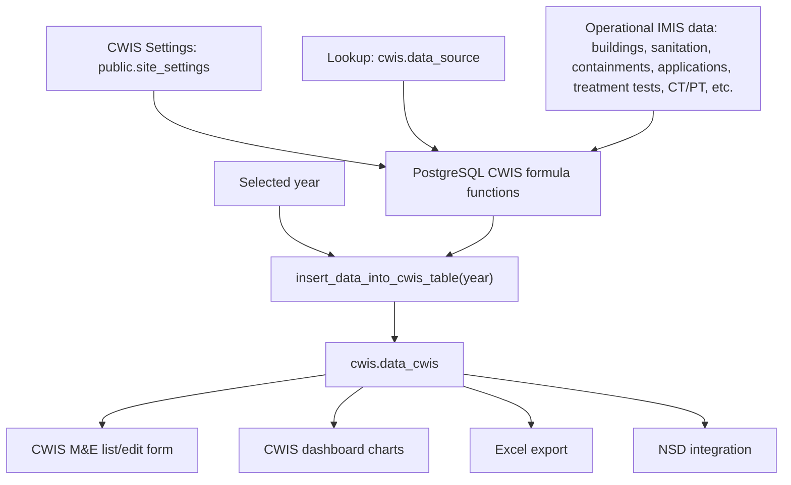

# CWIS Calculation Study

## Scope

This study traces how CWIS indicator values are generated, stored, edited, displayed, exported, and pushed onward from the Laravel codebase.

The important distinction is:

- Laravel triggers and displays CWIS calculations.
- The actual indicator formulas are not implemented in Laravel controllers/services.
- Formula execution is delegated to PostgreSQL through `insert_data_into_cwis_table(year)`.

## Main User Flows

### 1. Generate CWIS Indicator Data

Route:

- `GET /cwis/cwis-df-mne/newsurvey`
- `POST /cwis/cwis-df-mne/newsurvey`
- resource route: `/cwis/cwis/cwis-df-mne`

Relevant files:

- `routes/web.php`
- `app/Http/Controllers/Cwis/CwisMneController.php`
- `resources/views/cwis/cwis-df-mne/create.blade.php`
- `resources/views/cwis/cwis-df-mne/partial-form.blade.php`

Generation entry point:

```php
DB::select(DB::raw('select * from insert_data_into_cwis_table(' . $year . ');'));
```

This is in `CwisMneController::cwis($year)`. The controller calls a PostgreSQL function and returns its result as JSON. The selected year is passed directly into the DB function.

After generation, the controller reads generated rows from `cwis.data_cwis`:

```php
cwis_mne::where('year', $year)->pluck('data_value', 'indicator_code');
```

The create/edit form then shows one input per indicator. If a value already exists for that indicator/year, the input is disabled and a hidden value is submitted instead.

### 2. Store or Override Indicator Values

Relevant method:

- `CwisMneController::store()`

The controller iterates over a fixed indicator list:

- `EQ-1`
- `SF-1a` through `SF-1g`
- `SF-2a` through `SF-2c`
- `SF-3`, `SF-3b`, `SF-3c`, `SF-3e`
- `SF-4a`, `SF-4b`, `SF-4d`
- `SF-5`, `SF-6`, `SF-7`, `SF-9`
- `SS-1`

For each code, it checks `cwis.data_cwis` for the selected year and `indicator_code`. If the row exists, `data_value` is updated. If not, a new row is inserted.

Important: the model `App\Models\Cwis\cwis_mne` only declares `year` as fillable, but `store()` attempts to create rows with `indicator_code` and `data_value`. If mass-assignment protection is active, the create path may not persist those extra fields as intended.

### 3. Dashboard Display

Route:

- `GET /cwis/cwis/getall/{year?}`

Relevant files:

- `app/Http/Controllers/Cwis/CwisNewDashboardController.php`
- `resources/views/cwis/cwis-dashboard/chart-layout/cwis-dash-layout.blade.php`
- nested chart/card views under `resources/views/cwis/cwis-dashboard/`

The dashboard does not recalculate values. It selects rows from `cwis.data_cwis` by year and indicator code, maps each code to a view variable, and passes the result to Blade.

Example mapping:

```php
'EQ-1' => 'eq1',
'SF-1a' => 'sf1a',
'SF-1b' => 'sf1b',
...
'SS-1' => 'ss1',
```

The Blade layout uses Chart.js doughnut charts. The JavaScript caps chart drawing at 100, but still displays the original value text. It also detects invalid values like `NaN` or `na` and shows an explanatory modal.

### 4. Excel Export

Routes:

- `GET /cwis/cwis-df-mne/export-mne-csv`
- `GET /cwis/export-csv/{year}`

Relevant file:

- `app/Exports/MneCsvExport.php`

The export joins all indicators from `cwis.data_source` to generated values from `cwis.data_cwis`:

```sql
SELECT
    ds.outcome,
    ds.indicator_code,
    ds.label,
    dc.year,
    dc.data_value
FROM cwis.data_source ds
LEFT JOIN cwis.data_cwis dc
    ON dc.indicator_code = ds.indicator_code
    AND dc.year = ?
WHERE ds.indicator_code IS NOT NULL
ORDER BY ds.id
```

This means the export is complete even when some values are missing, because `data_source` is the driving table.

### 5. NSD Integration

Routes:

- `GET /nsd/cwis-data/{year}`
- `GET /nsd/cwis-status`

Relevant file:

- `app/Http/Controllers/Fsm/NsdDashboardController.php`

This flow reads CWIS indicator values and prepares them for the National Sanitation Dashboard integration. It is downstream of `cwis.data_cwis`; it does not appear to generate the CWIS values itself.

## Data Model

### `cwis.data_source`

Lookup table for indicator metadata:

- `outcome`
- `indicator_code`
- `label`

Seeded by:

- `database/seeders/CwisDataSourceSeeder.php`

Documented indicators include:

| Code      | Meaning                                                          |
| --------- | ---------------------------------------------------------------- |
| `EQ-1`  | Ratio of LIC access to total population access                   |
| `SF-1a` | Population with access to safe individual toilets/latrines       |
| `SF-1b` | On-site sanitation that have been desludged                      |
| `SF-1c` | Collected FS disposed at treatment plant/designated site         |
| `SF-1d` | FS treatment capacity vs total FS generated from NSS             |
| `SF-1e` | FS treatment capacity vs total FS collected from NSS             |
| `SF-1f` | Wastewater treatment capacity vs generated wastewater/greywater  |
| `SF-1g` | Treatment effectiveness against standards                        |
| `SF-2a` | LIC population with safe individual toilets                      |
| `SF-2b` | LIC, NSS, IHHLs that have been desludged                         |
| `SF-2c` | LIC-collected FS disposed at treatment plant/designated sites    |
| `SF-3`  | Dependent population with access to safe shared CT/PT facilities |
| `SF-3b` | CTs adhering to universal design                                 |
| `SF-3c` | CT users that are women                                          |
| `SF-3e` | Average distance from house to closest CT                        |
| `SF-4a` | PT FS/WW safely transported or disposed in situ                  |
| `SF-4b` | PTs adhering to universal design                                 |
| `SF-4d` | PT users that are women                                          |
| `SF-5`  | Educational institutions safely transporting/disposing FS/WW     |
| `SF-6`  | Healthcare facilities safely transporting/disposing FS/WW        |
| `SF-7`  | Desludging services completed mechanically/semi-mechanically     |
| `SF-9`  | Tests compliant with fecal coliform standards                    |

The controller also expects `SS-1`, but the visible data dictionary list reviewed in this study only documents up to `SF-9`. Confirm `SS-1` in the live `cwis.data_source` table or seed data.

### `cwis.data_cwis`

Yearly indicator values:

- `indicator_code`
- `year`
- `data_value`
- plus metadata fields depending on schema/source

This is the main table read by:

- dashboard
- M&E index/create/edit views
- Excel export
- NSD push/status flows

### `public.site_settings`

CWIS calculation constants live in `public.site_settings` with category `cwis_setting`.

Defaults from `CwisSettingsSeeder`:

| Setting                                                        | Default |
| -------------------------------------------------------------- | ------: |
| `average_water_consumption_lpcd`                             |     150 |
| `waste_water_conversion_factor`                              |      80 |
| `greywater_conversion_factor_connected_to_sewer`             |      80 |
| `greywater_conversion_factor_not_connected_to_sewer`         |      80 |
| `fs_generation_from_containment_not_connected_to_sewer_lpcd` |     270 |
| `fs_generation_from_permeable_or_unlined_pit_lpcd`           |     280 |

Editable through:

- `app/Http/Controllers/Fsm/CwisSettingController.php`
- `app/Services/Fsm/CwisSettingService.php`
- `resources/views/fsm/cwis-setting/index.blade.php`

These settings are likely consumed by the PostgreSQL formula functions, not by Laravel-side formula code.

## Where Calculations Actually Happen

The strongest evidence is the existing CWIS code documentation:

- CWIS uses 22 distinct indicators.
- Each indicator is handled by its own function.
- A master function categorizes each building as safely managed or not.
- `insert_data_into_cwis_table(year)` fetches indicators from `data_source`, computes values, and stores them in `data_cwis`.

However, the actual SQL bodies for:

- `insert_data_into_cwis_table`
- individual indicator functions
- the safe/unsafe building classification master function

were not found in the Laravel repository. The repo documentation says those functions are stored in a GitHub repository for version control and maintenance, but this checkout does not include the function source.

To fully audit formulas, inspect the live PostgreSQL database:

```sql
SELECT
    n.nspname AS schema_name,
    p.proname AS function_name,
    pg_get_functiondef(p.oid) AS function_definition
FROM pg_proc p
JOIN pg_namespace n ON n.oid = p.pronamespace
WHERE p.proname ILIKE '%cwis%'
   OR p.proname ILIKE '%safe%'
   OR p.proname ILIKE '%indicator%'
ORDER BY n.nspname, p.proname;
```

Start with:

```sql
SELECT pg_get_functiondef('insert_data_into_cwis_table(integer)'::regprocedure);
```

If the signature differs, find it first:

```sql
SELECT n.nspname, p.proname, pg_get_function_arguments(p.oid)
FROM pg_proc p
JOIN pg_namespace n ON n.oid = p.pronamespace
WHERE p.proname = 'insert_data_into_cwis_table';
```

## High-Level Calculation Dependency Map



## Important Risks / Findings

### 1. Formula source is outside this Laravel checkout

Laravel only calls `insert_data_into_cwis_table(year)`. Without the SQL function source, the exact numerator/denominator logic for each CWIS indicator cannot be fully validated from this repo alone.

Impact:

- Team can trace the workflow, but cannot prove formula correctness from Laravel code only.
- Any PM/QA sign-off on calculation formulas must include DB function review.

### 2. SQL call is built by string concatenation

`CwisMneController::cwis($year)` concatenates `$year` into raw SQL.

The route passes a year-like value, but the method has no explicit validation/casting before SQL construction. It should cast or bind the parameter.

Preferred pattern:

```php
DB::select('select * from insert_data_into_cwis_table(?)', [(int) $year]);
```

### 3. Manual edit form has indicator mismatches

In `partial-form.blade.php`:

- The label for dependent population with access to safe shared CT/PT facilities is wired to `name="SF-3b"`.
- The label for CT universal design is wired to `name="SF-3"`.
- Based on the documented data dictionary, those appear swapped.
- `SF-9` uses disable logic based on `$data['SF-7']`.
- `SF-9` hidden input is named `SF-7_hidden`, so an edited/disabled `SF-9` value can be submitted under the wrong field name.

Impact:

- Generated DB values may still be correct.
- Manual save/edit of displayed values can corrupt or fail to preserve `SF-3`, `SF-3b`, and `SF-9`.

### 4. `SS-1` is expected by controllers but not clearly documented in the reviewed indicator list

Both dashboard and store methods include `SS-1`. The data dictionary excerpt reviewed here lists 22 indicators ending at `SF-9`. Confirm whether `SS-1` is present in `cwis.data_source`, the SQL functions, and NSD expectations.

### 5. Invalid generated values are handled at display level

Dashboard and M&E index detect `NaN`, `nan`, and `na` values and show warnings. The UI explains likely causes such as zero denominator or undefined numerator/denominator combinations.

This is useful, but it means the DB function can still persist invalid text values. QA should test zero-denominator years explicitly.

## Recommended QA Checklist

1. Confirm `cwis.data_source` contains all expected indicators, including `SS-1` if it is meant to be active.
2. Run CWIS generation for a test year and verify one row per indicator in `cwis.data_cwis`.
3. Export the same year to Excel and confirm every `data_source` indicator appears, including missing/null generated values.
4. Open the dashboard for the generated year and confirm every card/chart maps to the correct indicator code.
5. Test a zero-denominator scenario and confirm the warning modal appears for `NaN`/`na`.
6. Review PostgreSQL function bodies for each indicator and document numerator, denominator, filters, and table joins.
7. Fix and retest manual form mappings for `SF-3`, `SF-3b`, and `SF-9`.
8. Validate that changing CWIS settings affects newly generated values as expected.

## Practical Next Step for a Complete Formula Audit

The next step is to extract the PostgreSQL CWIS functions from the live database or the referenced GitHub SQL-function repository. Once those are available, prepare a formula matrix:

| Indicator | Numerator            | Denominator          | Source tables | Filters | Settings used | Edge cases |
| --------- | -------------------- | -------------------- | ------------- | ------- | ------------- | ---------- |
| `EQ-1`  | TBD from DB function | TBD from DB function | TBD           | TBD     | TBD           | TBD        |
| `SF-1a` | TBD from DB function | TBD from DB function | TBD           | TBD     | TBD           | TBD        |
| `...`   | TBD                  | TBD                  | TBD           | TBD     | TBD           | TBD        |

That matrix cannot be completed accurately from the Laravel repository alone because the SQL function definitions are not present here.
