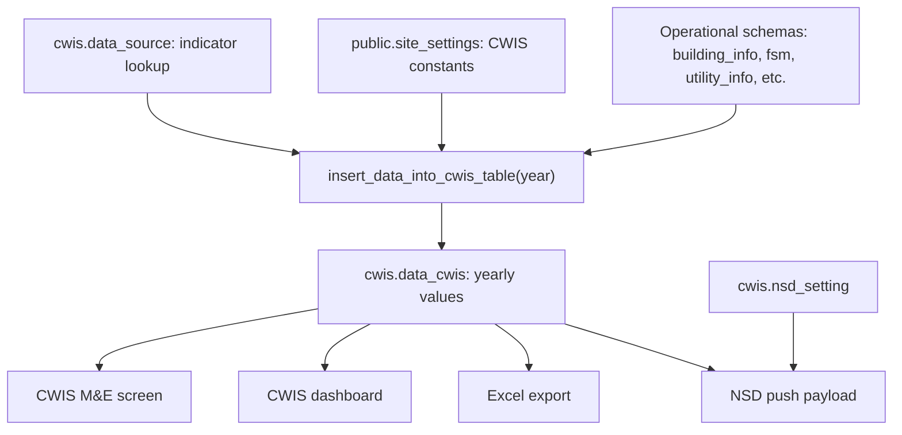

# CWIS Database Study

## Purpose

This document explains where the CWIS database parts live, how Laravel connects to them, which tables store lookup/settings/generated values, and where the actual CWIS calculation formulas are expected to be found.

It is a companion to:

- `docs/cwis-calculation-study.md`

## Current Database Connection

From the local `.env` file, the application is configured to use PostgreSQL:

| Key | Value |
|---|---|
| `DB_CONNECTION` | `pgsql` |
| `DB_HOST` | `127.0.0.1` |
| `DB_PORT` | `5433` |
| `DB_DATABASE` | `febbb` |
| `DB_USERNAME` | `postgres` |

Password values were intentionally not copied into this document.

## CWIS Database Schemas

The CWIS module uses at least two PostgreSQL schemas:

| Schema | Purpose |
|---|---|
| `cwis` | CWIS indicator lookup, generated indicator values, and NSD integration settings |
| `public` | Shared application settings, including CWIS calculation constants in `site_settings` |

The broader calculations also depend on operational schemas such as `building_info`, `fsm`, `utility_info`, and probably others, but the exact source-table joins are inside PostgreSQL functions that are not present in this Laravel checkout.

## Main CWIS Tables

### 1. `cwis.data_source`

Purpose:

- Lookup/master table for CWIS indicator definitions.
- Drives the indicator list shown in exports and generation screens.

Laravel model:

- `app/Models/Cwis/DataSource.php`

Model table mapping:

```php
protected $table = 'cwis.data_source';
```

Seeder:

- `database/seeders/CwisDataSourceSeeder.php`

Seeder registration:

- `database/seeders/DatabaseSeeder.php`

Seed logic:

- Checks `cwis.data_source` by `indicator_code`.
- Inserts a row only when that indicator code does not already exist.

Seeded columns:

| Column | Source in seeder |
|---|---|
| `id` | fixed numeric id |
| `outcome` | `equity` or `safety` |
| `indicator_code` | CWIS indicator code |
| `label` | display label / indicator description |

Seeded rows:

| ID | Outcome | Code | Label |
|---:|---|---|---|
| 1 | equity | `EQ-1` | Ratio of LIC access to total population access |
| 2 | safety | `SF-1a` | Percentage of population with access to safe, private, individual toilets/latrines |
| 3 | safety | `SF-1b` | Percentage of on-site sanitation that have been desludged |
| 4 | safety | `SF-1c` | Percentage of collected FS disposed at a treatment plant or at designated disposal site |
| 5 | safety | `SF-1d` | FS treatment capacity as a percentage of total FS generated from NSS connections, excluding safely disposed in situ |
| 6 | safety | `SF-1e` | FS treatment capacity as a percentage of total FS collected from NSS connections |
| 7 | safety | `SF-1f` | Wastewater treatment capacity as a percentage of wastewater/greywater generated |
| 8 | safety | `SF-1g` | Effectiveness of FS/WW treatment in meeting discharge/disposal standards |
| 9 | safety | `SF-2a` | Percentage LIC population with access to safe individual toilets |
| 10 | safety | `SF-2b` | Percentage of LIC, NSS, IHHLs that have been desludged |
| 11 | safety | `SF-2c` | Percentage of LIC-collected FS disposed at treatment plant/designated sites |
| 12 | safety | `SF-3` | Percentage of dependent population with access to safe shared CT/PT facilities |
| 13 | safety | `SF-3b` | Percentage of CTs that adhere to universal design |
| 14 | safety | `SF-3c` | Percentage of CT users that are women |
| 15 | safety | `SF-3e` | Average distance from house to closest CT |
| 16 | safety | `SF-4a` | Percentage of PTs where FS/WW is safely transported or disposed in situ |
| 17 | safety | `SF-4b` | Percentage of PTs that adhere to universal design |
| 18 | safety | `SF-4d` | Percentage of PT users that are women |
| 19 | safety | `SF-5` | Percentage of educational institutions where FS/WW is safely transported or disposed in situ |
| 20 | safety | `SF-6` | Percentage of healthcare facilities where FS/WW is safely transported or disposed in situ |
| 21 | safety | `SF-7` | Percentage of desludging services completed mechanically or semi-mechanically |
| 22 | safety | `SF-9` | Percentage of tests compliant with water quality standards for fecal coliform |

Important finding:

- The controller code expects `SS-1`, but `CwisDataSourceSeeder` seeds only 22 indicators and does not include `SS-1`.
- Confirm in the live database whether `SS-1` exists manually. If not, the controller has a stale or missing indicator expectation.

Useful DB checks:

```sql
SELECT id, outcome, indicator_code, label
FROM cwis.data_source
ORDER BY id;
```

```sql
SELECT indicator_code, count(*)
FROM cwis.data_source
GROUP BY indicator_code
HAVING count(*) > 1;
```

```sql
SELECT *
FROM cwis.data_source
WHERE indicator_code = 'SS-1';
```

### 2. `cwis.data_cwis`

Purpose:

- Main yearly table for generated or user-edited CWIS indicator values.
- This is the table read by the CWIS dashboard, M&E list, exports, and NSD push flow.

Laravel model:

- `app/Models/Cwis/cwis_mne.php`

Model table mapping:

```php
protected $table = 'cwis.data_cwis';
```

Known/documented columns:

| Column | Purpose |
|---|---|
| `id` | unique row id |
| `outcome` | CWIS outcome such as equity/safety |
| `indicator_code` | link to indicator code from `cwis.data_source` |
| `label` | indicator label |
| `year` | generated/reporting year |
| `data_value` | actual computed or manually saved value |
| `created_at` | creation timestamp |
| `updated_at` | update timestamp |
| `deleted_at` | soft-delete timestamp, if present in live schema |

Other fields are referenced by older/show methods:

- `source_id`
- `parameter_id`
- `assmntmtrc_dtpnt`
- `unit`
- `co_cf`
- `data_type`
- `sym_no`

That means the live table may have more fields than the simplified data dictionary section. Confirm with `information_schema` before changing code.

Useful schema check:

```sql
SELECT
    column_name,
    data_type,
    is_nullable,
    column_default
FROM information_schema.columns
WHERE table_schema = 'cwis'
  AND table_name = 'data_cwis'
ORDER BY ordinal_position;
```

Useful yearly data checks:

```sql
SELECT year, count(*) AS row_count
FROM cwis.data_cwis
GROUP BY year
ORDER BY year DESC;
```

```sql
SELECT indicator_code, data_value
FROM cwis.data_cwis
WHERE year = 2025
ORDER BY indicator_code;
```

```sql
SELECT indicator_code, data_value
FROM cwis.data_cwis
WHERE lower(data_value) IN ('nan', 'na')
ORDER BY year DESC, indicator_code;
```

Coverage check against lookup table:

```sql
SELECT
    ds.indicator_code,
    ds.label,
    dc.year,
    dc.data_value
FROM cwis.data_source ds
LEFT JOIN cwis.data_cwis dc
    ON dc.indicator_code = ds.indicator_code
   AND dc.year = 2025
ORDER BY ds.id;
```

Missing generated values for a year:

```sql
SELECT ds.indicator_code, ds.label
FROM cwis.data_source ds
LEFT JOIN cwis.data_cwis dc
    ON dc.indicator_code = ds.indicator_code
   AND dc.year = 2025
WHERE dc.indicator_code IS NULL
ORDER BY ds.id;
```

### 3. `public.site_settings`

Purpose:

- Shared settings table.
- CWIS uses rows where `category = 'cwis_setting'`.
- These rows store numeric constants likely consumed by the PostgreSQL CWIS calculation functions.

Laravel models:

- `app/Models/Fsm/CwisSetting.php`
- `app/Models/SiteSetting.php`

CWIS model mapping:

```php
protected $table = 'public.site_settings';
```

Seeder:

- `database/seeders/CwisSettingsSeeder.php`

Editable from:

- `app/Http/Controllers/Fsm/CwisSettingController.php`
- `app/Services/Fsm/CwisSettingService.php`
- `resources/views/fsm/cwis-setting/index.blade.php`

Seeded settings:

| ID | Name | Default value | Category |
|---:|---|---:|---|
| 1 | `average_water_consumption_lpcd` | 150 | `cwis_setting` |
| 2 | `waste_water_conversion_factor` | 80 | `cwis_setting` |
| 3 | `greywater_conversion_factor_connected_to_sewer` | 80 | `cwis_setting` |
| 4 | `greywater_conversion_factor_not_connected_to_sewer` | 80 | `cwis_setting` |
| 5 | `fs_generation_from_containment_not_connected_to_sewer_lpcd` | 270 | `cwis_setting` |
| 6 | `fs_generation_from_permeable_or_unlined_pit_lpcd` | 280 | `cwis_setting` |

Useful DB check:

```sql
SELECT id, name, value, category
FROM public.site_settings
WHERE category = 'cwis_setting'
ORDER BY id;
```

Important behavior:

- The settings controller updates existing rows by `name`.
- If a required row is missing, the current service does not create it; it only updates found rows.
- Run the seeder or insert missing rows before relying on calculations.

### 4. `cwis.nsd_setting`

Purpose:

- Stores National Sanitation Dashboard integration settings.
- This is not part of CWIS calculation itself, but it is a downstream CWIS DB consumer because NSD push reads from `cwis.data_cwis`.

Migration:

- `database/migrations/2025_04_28_123002_nsd_setting.php`

Laravel model:

- `app/Models/Fsm/Nsd.php`

Model table mapping:

```php
protected $table = 'cwis.nsd_setting';
```

Migration columns:

| Column | Type | Purpose |
|---|---|---|
| `id` | bigint/id | primary key |
| `nsd_username` | string(256) | NSD username |
| `city` | string(256) | NSD city identifier/name |
| `api_post_url` | text | base URL for posting CWIS indicators/status |
| `api_login_url` | text | base URL for NSD authentication |
| `nsd_password` | string(256) | encrypted NSD password |
| `created_at` | timestamp | created timestamp |
| `updated_at` | timestamp | updated timestamp |
| `deleted_at` | timestamp | soft delete timestamp |

Relevant controllers:

- `app/Http/Controllers/Fsm/NsdSettingController.php`
- `app/Http/Controllers/Fsm/NsdDashboardController.php`

Useful DB check:

```sql
SELECT id, nsd_username, city, api_post_url, api_login_url, created_at, updated_at, deleted_at
FROM cwis.nsd_setting
ORDER BY id;
```

Do not select or export `nsd_password` unless debugging encryption/authentication with proper authorization.

## PostgreSQL Functions

The actual CWIS calculations are expected to be in PostgreSQL functions, not Laravel.

Confirmed Laravel trigger:

- `app/Http/Controllers/Cwis/CwisMneController.php`

The code calls:

```php
DB::select(DB::raw('select * from insert_data_into_cwis_table(' . $year . ');'));
```

Existing code documentation says:

- CWIS uses 22 distinct indicators.
- Each indicator is calculated by its own function.
- A master function categorizes buildings as safely managed or not.
- `insert_data_into_cwis_table(year)` coordinates generation and stores results in `cwis.data_cwis`.
- The indicator functions are stored in a GitHub repository, but their SQL definitions are not present in this Laravel checkout.

Because the function source is absent from this repo, a complete formula audit must be done from the live PostgreSQL database or the external SQL-function repo.

Function discovery query:

```sql
SELECT
    n.nspname AS schema_name,
    p.proname AS function_name,
    pg_get_function_arguments(p.oid) AS arguments,
    pg_get_function_result(p.oid) AS result_type
FROM pg_proc p
JOIN pg_namespace n ON n.oid = p.pronamespace
WHERE p.proname ILIKE '%cwis%'
   OR p.proname ILIKE '%safe%'
   OR p.proname ILIKE '%indicator%'
   OR p.proname ILIKE '%sanitation%'
ORDER BY n.nspname, p.proname;
```

Definition extraction:

```sql
SELECT pg_get_functiondef(p.oid)
FROM pg_proc p
JOIN pg_namespace n ON n.oid = p.pronamespace
WHERE p.proname = 'insert_data_into_cwis_table';
```

If the exact signature is known:

```sql
SELECT pg_get_functiondef('insert_data_into_cwis_table(integer)'::regprocedure);
```

Dependency discovery for function bodies:

```sql
SELECT
    n.nspname AS schema_name,
    p.proname AS function_name,
    pg_get_functiondef(p.oid) AS function_definition
FROM pg_proc p
JOIN pg_namespace n ON n.oid = p.pronamespace
WHERE pg_get_functiondef(p.oid) ILIKE '%cwis.data_cwis%'
   OR pg_get_functiondef(p.oid) ILIKE '%cwis.data_source%'
   OR pg_get_functiondef(p.oid) ILIKE '%site_settings%'
ORDER BY n.nspname, p.proname;
```

## Laravel Read/Write Map

| DB object | Written by | Read by | Notes |
|---|---|---|---|
| `cwis.data_source` | `CwisDataSourceSeeder` | `CwisMneController`, `MneCsvExport`, DB function | Lookup/master indicator list |
| `cwis.data_cwis` | PostgreSQL function, `CwisMneController::store()` | dashboard, M&E views, export, NSD push | Main yearly result table |
| `public.site_settings` | `CwisSettingsSeeder`, `CwisSettingService` | settings page, likely DB functions | Holds CWIS constants |
| `cwis.nsd_setting` | `NsdSettingController` | `NsdDashboardController` | Integration config, not formula data |

## End-to-End DB Flow



## DB Setup / Seed Order

The application seeder calls CWIS seeders in this order:

1. `CwisSettingsSeeder`
2. `CwisDataSourceSeeder`

Relevant file:

- `database/seeders/DatabaseSeeder.php`

Commands normally used:

```bash
php artisan db:seed --class=CwisSettingsSeeder
php artisan db:seed --class=CwisDataSourceSeeder
```

If setting up NSD integration table:

```bash
php artisan migrate --path=database/migrations/2025_04_28_123002_nsd_setting.php
```

Note:

- This repo has seeders for `cwis.data_source` and `public.site_settings`.
- This repo does not show migrations that create `cwis.data_source` or `cwis.data_cwis`.
- Those core CWIS tables may be expected to exist from a base database dump or external SQL migration package.

## Audit Checklist for DB Verification

Run these checks on the live DB:

1. Confirm `cwis` schema exists.

```sql
SELECT schema_name
FROM information_schema.schemata
WHERE schema_name = 'cwis';
```

2. Confirm CWIS tables exist.

```sql
SELECT table_schema, table_name
FROM information_schema.tables
WHERE table_schema IN ('cwis', 'public')
  AND table_name IN ('data_source', 'data_cwis', 'nsd_setting', 'site_settings')
ORDER BY table_schema, table_name;
```

3. Confirm lookup indicators.

```sql
SELECT count(*) AS indicator_count
FROM cwis.data_source;
```

Expected from seeder: `22`.

4. Confirm `SS-1`.

```sql
SELECT *
FROM cwis.data_source
WHERE indicator_code = 'SS-1';
```

If no row returns, review why controllers expect it.

5. Confirm CWIS settings.

```sql
SELECT name, value
FROM public.site_settings
WHERE category = 'cwis_setting'
ORDER BY id;
```

Expected from seeder: `6` rows.

6. Confirm generated data by year.

```sql
SELECT year, count(*)
FROM cwis.data_cwis
GROUP BY year
ORDER BY year DESC;
```

7. Confirm generated data covers lookup indicators.

```sql
SELECT ds.indicator_code
FROM cwis.data_source ds
LEFT JOIN cwis.data_cwis dc
    ON dc.indicator_code = ds.indicator_code
   AND dc.year = 2025
WHERE dc.id IS NULL
ORDER BY ds.id;
```

8. Confirm stored functions exist.

```sql
SELECT n.nspname, p.proname, pg_get_function_arguments(p.oid)
FROM pg_proc p
JOIN pg_namespace n ON n.oid = p.pronamespace
WHERE p.proname = 'insert_data_into_cwis_table';
```

9. Extract function source for formula review.

```sql
SELECT pg_get_functiondef(p.oid)
FROM pg_proc p
JOIN pg_namespace n ON n.oid = p.pronamespace
WHERE p.proname = 'insert_data_into_cwis_table';
```

## Key Risks / Gaps

### 1. Core table migrations are not visible in this checkout

The repo includes the NSD setting migration, but not obvious migrations for:

- `cwis.data_source`
- `cwis.data_cwis`
- `public.site_settings`

Those may be part of a base database dump, older migration set, or external DB package.

### 2. Formula functions are outside Laravel

Without PostgreSQL function definitions, the exact formulas cannot be verified from PHP code.

### 3. `SS-1` mismatch

Code expects `SS-1`, but the seeder and data dictionary show only 22 indicators ending at `SF-9`.

### 4. Manual insert/update path may not match schema

`cwis_mne` only has `year` in `$fillable`, but `CwisMneController::store()` tries to create rows with `indicator_code` and `data_value`.

### 5. DB function call should bind year

The generation call currently concatenates year into raw SQL. It should bind/cast the year.

Preferred:

```php
DB::select('select * from insert_data_into_cwis_table(?)', [(int) $year]);
```

## Practical Next Step

For a complete DB-side formula document, extract the PostgreSQL functions from the live database and add a formula matrix:

| Indicator | DB function | Numerator | Denominator | Source tables | Filters | Settings used | Edge-case behavior |
|---|---|---|---|---|---|---|---|
| `EQ-1` | TBD | TBD | TBD | TBD | TBD | TBD | TBD |
| `SF-1a` | TBD | TBD | TBD | TBD | TBD | TBD | TBD |
| `SF-1b` | TBD | TBD | TBD | TBD | TBD | TBD | TBD |

The Laravel repository identifies where data is stored and how generation is triggered, but the exact calculation formulas live in PostgreSQL function definitions that must be inspected separately.
