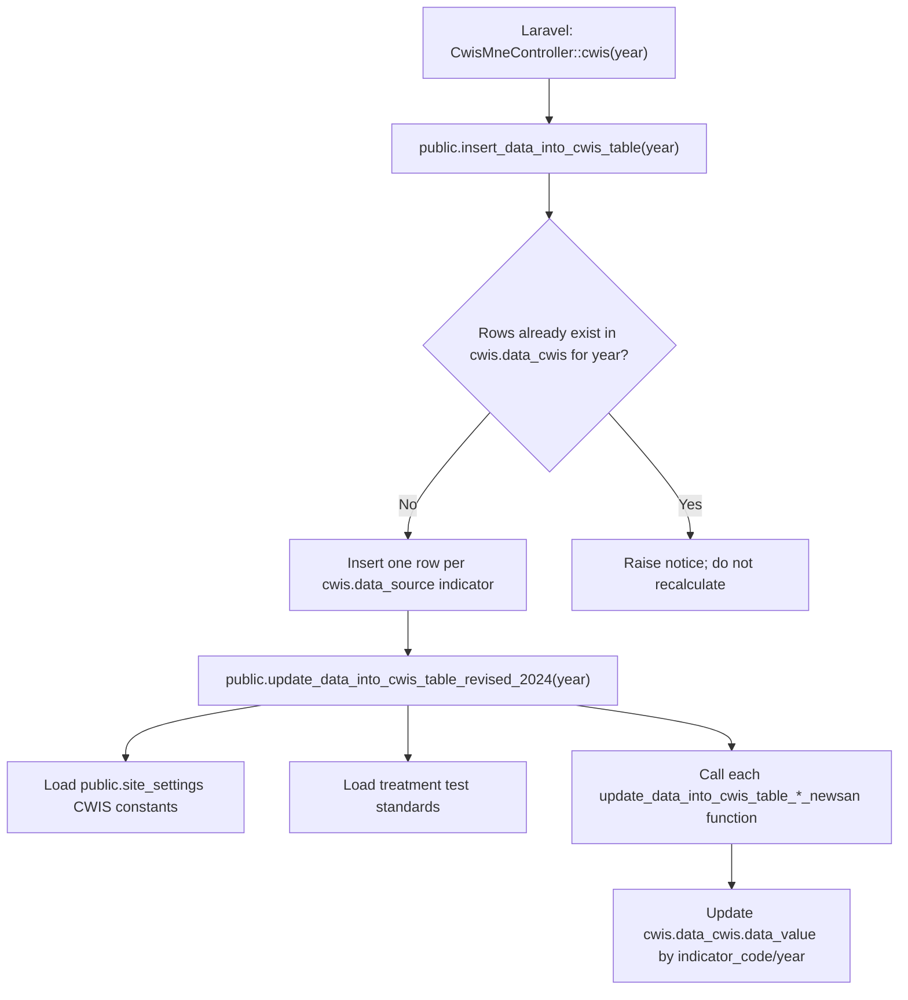

# CWIS DB Function and Formula Deep Study

## Scope

This document studies the live PostgreSQL CWIS calculation functions behind the Laravel CWIS generator.

Evidence extracted from the local PostgreSQL database:

- `docs/cwis-db-functions-extracted.sql`
- `docs/cwis-safe-sanitation-helper-extracted.sql`
- `docs/cwis-safe-sanitation-helper-parts-extracted.sql`

The extraction used the app's local PostgreSQL connection from `.env`. DB passwords were not written into any document.

## Function Inventory

All extracted CWIS calculation functions are in the `public` schema:

| Function | Role |
|---|---|
| `insert_data_into_cwis_table(_year integer)` | Wrapper called by Laravel. Creates yearly `cwis.data_cwis` rows and triggers all formula updates. |
| `update_data_into_cwis_table_revised_2024(_year integer)` | Master updater. Loads settings and calls each indicator function. |
| `update_data_into_cwis_table_eq_1_newsan(_year integer)` | Calculates `EQ-1`. |
| `update_data_into_cwis_table_sf_1a_newsan(_year integer)` | Calculates `SF-1a`. |
| `update_data_into_cwis_table_sf_1b_newsan(_year integer)` | Calculates `SF-1b`. |
| `update_data_into_cwis_table_sf_1c_newsan(_year integer)` | Calculates `SF-1c`. |
| `update_data_into_cwis_table_sf_1d_newsan(_year integer, fs settings...)` | Calculates `SF-1d`. |
| `update_data_into_cwis_table_sf_1e_newsan(_year integer)` | Calculates `SF-1e`. |
| `update_data_into_cwis_table_sf_1f_newsan(_year integer, water/wastewater settings...)` | Calculates `SF-1f`. |
| `update_data_into_cwis_table_sf_1g_newsan(_year integer, bod/tss/ecoli standards)` | Calculates `SF-1g`. |
| `update_data_into_cwis_table_sf_2a_newsan(_year integer)` | Calculates `SF-2a`. |
| `update_data_into_cwis_table_sf_2b_newsan(_year integer)` | Calculates `SF-2b`. |
| `update_data_into_cwis_table_sf_2c_newsan(_year integer)` | Calculates `SF-2c`. |
| `update_data_into_cwis_table_sf_3_newsan(_year integer)` | Calculates `SF-3`. |
| `update_data_into_cwis_table_sf_3b_newsan(_year integer)` | Calculates `SF-3b`. |
| `update_data_into_cwis_table_sf_3c_newsan(_year integer)` | Calculates `SF-3c`. |
| `update_data_into_cwis_table_sf_3e_newsan(_year integer)` | Calculates `SF-3e`. |
| `update_data_into_cwis_table_sf_4a_newsan(_year integer)` | Calculates `SF-4a`. |
| `update_data_into_cwis_table_sf_4b_newsan(_year integer)` | Calculates `SF-4b`. |
| `update_data_into_cwis_table_sf_4d_newsan(_year integer)` | Calculates `SF-4d`. |
| `update_data_into_cwis_table_sf_5_newsan(_year integer)` | Calculates `SF-5`. |
| `update_data_into_cwis_table_sf_6_newsan(_year integer)` | Calculates `SF-6`. |
| `update_data_into_cwis_table_sf_7_newsan(_year integer)` | Calculates `SF-7`. |
| `update_data_into_cwis_table_sf_9_newsan(_year integer)` | Calculates `SF-9`. |

Shared helper functions:

| Function | Role |
|---|---|
| `execute_select_build_sanisys_nd_criterias()` | Central safe-sanitation helper used by most building/sanitation indicators. |
| `execute_select_build_sanisys_nd_criterias_part1()` | Base building + sanitation + containment + sewer/drain data. |
| `execute_select_build_sanisys_nd_criterias_part2()` | Community-toilet infrastructure and linked dependent buildings. |
| `execute_select_build_sanisys_nd_criterias_part3()` | Latest emptying/desludging status per containment. |

## Generation Flow



Important behavior:

- `insert_data_into_cwis_table(_year)` only calls the formula updater when the selected year has zero rows in `cwis.data_cwis`.
- If any row already exists for that year, the wrapper raises a notice and does not recalculate values.
- Manual edits through Laravel update `cwis.data_cwis`, not the source calculation tables.

## Settings Used By Master Function

`update_data_into_cwis_table_revised_2024(_year)` reads these settings from `public.site_settings`:

| Setting | Used by |
|---|---|
| `average_water_consumption_lpcd` | `SF-1f` |
| `waste_water_conversion_factor` | `SF-1f` |
| `greywater_conversion_factor_connected_to_sewer` | `SF-1f` |
| `greywater_conversion_factor_not_connected_to_sewer` | `SF-1f` |
| `fs_generation_from_containment_not_connected_to_sewer_lpcd` | `SF-1d` |
| `fs_generation_from_permeable_or_unlined_pit_lpcd` | `SF-1d` |

It also reads standards from `public.treatment_plant_performance_efficiency_test_settings`:

| Standard | Used by |
|---|---|
| `bod_standard` | `SF-1g` |
| `tss_standard` | `SF-1g` |
| `ecoli_standard` | `SF-1g` |

## Shared Calculation Pattern

Most percentage indicators use this pattern:

```text
result = round((numerator / denominator) * 100, 0)
```

They store text `'NaN'` when:

- numerator is `NULL`;
- denominator is `NULL`;
- denominator is `0`;
- numerator and denominator are both `0`.

Exceptions:

- `EQ-1` stores a ratio rounded to 3 decimals, not a percent.
- `SF-3e` stores average distance in meters, not a percent.
- `SF-7` sets numerator and denominator to the same emptying count, so any non-zero emptying count returns `100`.

## Safe-Sanitation Helper

### Main Helper Output

`execute_select_build_sanisys_nd_criterias()` returns one enriched row per building/sanitation relationship with fields including:

- building identity: `bin`, `building_associated_to`;
- building use: `functional_use_id`, `use_category_id`;
- year filter field: `construction_year`;
- population fields: `household_served`, `population_served`, `household_with_private_toilet`, `population_with_private_toilet`;
- LIC flag: `lic_id`;
- toilet fields: `toilet_presence_status`, `toilet_count`, `toilet_type`, `toilet_id`, `toilet_operation_status`;
- sanitation system fields: `sanitation_system_id`, `ct_sanitation_system_id`;
- containment fields: `containment_id`, `containment_type_id`, `ct_containment_type_id`, `construction_date`, `size`;
- sewer/drain fields: `sewer_code`, `sewer_connected_to_tp`, `drain_code`, `drain_cover_type`, `drain_surface_type`, `drain_connected_to_tp`;
- emptying fields: `no_of_times_emptied`, `latest_emptying_status`, `latest_emptied_date`;
- derived result: `safely_managed_sanitation_system`.

### Helper Part 1

`execute_select_build_sanisys_nd_criterias_part1()` collects base building sanitation data from:

- `building_info.buildings`
- `building_info.build_contains`
- `fsm.containments`
- `fsm.toilets`
- `utility_info.sewers`
- `utility_info.drains`

It brings together building population, private toilet count, sanitation system id, containment id/type, sewer treatment plant link, and drain treatment/cover/surface metadata.

### Helper Part 2

`execute_select_build_sanisys_nd_criterias_part2()` maps community toilet infrastructure to buildings using:

- `building_info.buildings`
- `fsm.toilets`
- `building_info.build_contains`
- `fsm.containments`
- `fsm.containment_types`
- `building_info.sanitation_systems`
- `utility_info.sewers`
- `utility_info.drains`
- `fsm.build_toilets`

Community toilet filter:

- `functional_use_id = 8`
- `use_category_id = 34`
- `lower(t.type) = 'community toilet'`
- `t.status IS TRUE`
- `b.deleted_at IS NULL`

### Helper Part 3

`execute_select_build_sanisys_nd_criterias_part3()` calculates latest emptying state per containment using:

- `fsm.applications`
- `fsm.containments`
- `fsm.emptyings`

It only considers applications where:

- `deleted_at IS NULL`
- `emptying_status IS TRUE`

It ranks applications by `application_date` and keeps the latest application per containment.

### Safe / Unsafe Classification Rules

The helper produces `safely_managed_sanitation_system = 'yes'` for these cases.

For non-community, non-shared sanitation systems:

| Condition | Safe when |
|---|---|
| `sanitation_system_id = 6` | always safe |
| `sanitation_system_id = 5` | always safe |
| `sanitation_system_id = 1` | sewer exists and sewer is connected to a treatment plant |
| `sanitation_system_id = 2` | drain exists and drain is connected to a treatment plant |
| `sanitation_system_id = 2` | drain exists, drain is closed, and drain is lined |
| `sanitation_system_id = 4`, containment type `8` or `10` | containment exists |
| `sanitation_system_id = 4`, containment type `13` | containment exists, sewer exists, sewer connected to treatment plant |
| `sanitation_system_id = 4`, containment type `14` | containment exists, drain exists, drain connected to treatment plant |
| `sanitation_system_id = 4`, containment type `14` | containment exists, drain exists, drain is closed and lined |
| `sanitation_system_id = 3`, containment type `3` | containment exists |
| `sanitation_system_id = 3`, containment type `1` | containment exists, sewer exists, sewer connected to treatment plant |
| `sanitation_system_id = 3`, containment type `2` | containment exists, drain exists, drain connected to treatment plant |
| `sanitation_system_id = 3`, containment type `2` | containment exists, drain exists, drain is closed and lined |

For shared containment (`sanitation_system_id = 11`), the same containment/sewer/drain rules are applied using `sanitation_system_id = 11`.

For community toilet dependency (`sanitation_system_id = 9`), the same rules are applied using community toilet fields:

- `ct_sanitation_system_id`
- `ct_containment_type_id`
- shared sewer/drain fields derived from the CT infrastructure

Everything else is marked `'no'`.

## Indicator Formula Matrix

### `EQ-1`: Equity Ratio

Function:

- `update_data_into_cwis_table_eq_1_newsan(_year integer)`

Formula:

```text
(LIC safe-private-toilet population / total LIC population)
/
(city safe-private-toilet population / total city population)
```

Output:

- ratio rounded to 3 decimals;
- not multiplied by 100.

Sources:

- `execute_select_build_sanisys_nd_criterias()`

Filters:

- LIC numerator: `safely_managed_sanitation_system = 'yes'`, `lic_id IS NOT NULL`, `construction_year <= _year`
- LIC denominator: `lic_id IS NOT NULL`, `construction_year <= _year`
- city numerator: `safely_managed_sanitation_system = 'yes'`, `construction_year <= _year`
- city denominator: `construction_year <= _year`

Caveat:

- Uses `COALESCE(..., 0)` around the final ratio, so division gaps become `0` rather than text `NaN`.

### `SF-1a`: Population With Safe Individual Toilets

Function:

- `update_data_into_cwis_table_sf_1a_newsan(_year integer)`

Formula:

```text
population_with_private_toilet where safely managed / total population served
```

Sources:

- `execute_select_build_sanisys_nd_criterias()`

Filters:

- numerator: `safely_managed_sanitation_system = 'yes'`, `construction_year <= _year`
- denominator: `construction_year <= _year`

Output:

- percent rounded to 0 decimals.

### `SF-1b`: On-Site Sanitation Desludged

Function:

- `update_data_into_cwis_table_sf_1b_newsan(_year integer)`

Formula:

```text
OSS containments emptied in selected year / total distinct OSS containments built up to selected year
```

Sources:

- `execute_select_build_sanisys_nd_criterias()`

Filters:

- numerator: `latest_emptying_status IS TRUE`, `latest_emptied_date year = _year`
- denominator: `construction_year <= _year`

Output:

- percent rounded to 0 decimals.

Caveat:

- Numerator uses only the latest emptying status/date carried by the helper. If a containment was emptied earlier in the year but later has another status/date outside the year, behavior depends on helper ranking.

### `SF-1c`: Collected FS Disposed At Treatment Plant / Designated Site

Function:

- `update_data_into_cwis_table_sf_1c_newsan(_year integer)`

Formula:

```text
sum(sludge_collections.volume_of_sludge in selected year)
/
sum(emptyings.volume_of_sludge in selected year)
```

Sources:

- `fsm.sludge_collections`
- `fsm.emptyings`

Filters:

- sludge collection date year = `_year`
- emptying date year = `_year`
- `deleted_at IS NULL` on both tables

Output:

- percent rounded to 0 decimals.

### `SF-1d`: FS Treatment Capacity vs FS Generated From NSS

Function:

- `update_data_into_cwis_table_sf_1d_newsan(_year, fs_generation_from_containment_not_connected_to_sewer_lpcd, fs_generation_from_permeable_or_unlined_pit_lpcd)`

Formula:

```text
annual FSTP/co-treatment capacity
/
(annual FS from non-sewer containments + annual FS from permeable/unlined pits)
```

Numerator:

```text
sum(fsm.treatment_plants.capacity_per_day where type in 3,4 and operational) * 365
```

Denominator:

```text
sum(population_served for eligible non-sewer containments)
* fs_generation_from_containment_not_connected_to_sewer_lpcd / 1,000,000
* 365
+
sum(population_served for permeable/unlined pits)
* fs_generation_from_permeable_or_unlined_pit_lpcd / 1,000,000
* 365
```

Sources:

- `fsm.treatment_plants`
- `execute_select_build_sanisys_nd_criterias()`
- `public.site_settings`

Treatment plant filters:

- `type IN (3, 4)`
- `status IS TRUE`
- `deleted_at IS NULL`

Containment filters:

- non-sewer containments: sanitation systems `3,4,11` with containment types `2,4,5,6,7,11,12,14,15,16,17`, including CT equivalents;
- permeable/unlined pits: sanitation system `4` with containment type `9`, including CT equivalent;
- `construction_year <= _year`.

Output:

- percent rounded to 0 decimals.

### `SF-1e`: FS Treatment Capacity vs FS Collected

Function:

- `update_data_into_cwis_table_sf_1e_newsan(_year integer)`

Formula:

```text
annual FSTP/co-treatment capacity / total collected sludge volume
```

Numerator:

```text
sum(fsm.treatment_plants.capacity_per_day where type in 3,4 and operational) * 365
```

Denominator:

```text
sum(fsm.sludge_collections.volume_of_sludge for selected year)
```

Sources:

- `fsm.treatment_plants`
- `fsm.sludge_collections`

Output:

- percent rounded to 0 decimals.

### `SF-1f`: Wastewater Treatment Capacity vs Wastewater/Greywater Generated

Function:

- `update_data_into_cwis_table_sf_1f_newsan(_year, average_water_consumption_lpcd, waste_water_conversion_factor, greywater_conversion_factor_connected_to_sewer, greywater_conversion_factor_not_connected_to_sewer)`

Formula:

```text
annual WWTP capacity
/
(
  wastewater from sewer-connected IHHLs
  + greywater/supernatant from onsite containment connected to sewers
  + greywater/supernatant from onsite containment not connected to sewers
  + greywater from pits/open sanitation groups
)
```

Numerator:

```text
sum(treatment_plants.capacity_per_day where type in 1,2 and operational) * 365
```

Denominator components:

```text
population_served * average_water_consumption_lpcd / 1,000,000 * conversion_factor / 100 * 365
```

Sources:

- `fsm.treatment_plants`
- `execute_select_build_sanisys_nd_criterias()`
- `public.site_settings`

Treatment plant filters:

- `type IN (1, 2)`
- `status IS TRUE`
- `deleted_at IS NULL`

Sanitation filters:

- sewer network and CT sewer network for wastewater;
- containment types `1,13` connected to sewer for sewered greywater/supernatant;
- onsite containment types not connected to sewer for non-sewer greywater/supernatant;
- sanitation systems `7,8` and pit containment type `9` for pit/open sanitation greywater;
- `construction_year <= _year`.

Output:

- percent rounded to 0 decimals.

### `SF-1g`: Treatment Effectiveness Against Standards

Function:

- `update_data_into_cwis_table_sf_1g_newsan(_year, bod_standard, tss_standard, ecoli_standard)`

Formula:

```text
number of treatment plant tests meeting BOD, TSS, and E. coli standards
/
total treatment plant tests
```

Sources:

- `fsm.treatmentplant_tests`
- `public.treatment_plant_performance_efficiency_test_settings`

Filters:

- `EXTRACT(year from date) = _year`
- test passes when `bod <= bod_standard`, `tss <= tss_standard`, and `ecoli <= ecoli_standard`

Output:

- percent rounded to 0 decimals.

### `SF-2a`: LIC Population With Safe Individual Toilets

Function:

- `update_data_into_cwis_table_sf_2a_newsan(_year integer)`

Formula:

```text
LIC population_with_private_toilet where safely managed / total LIC population served
```

Sources:

- `execute_select_build_sanisys_nd_criterias()`

Filters:

- numerator: `safely_managed_sanitation_system = 'yes'`, `lic_id IS NOT NULL`, `construction_year <= _year`
- denominator: `lic_id IS NOT NULL`, `construction_year <= _year`

Output:

- percent rounded to 0 decimals.

### `SF-2b`: LIC NSS/IHHLs Desludged

Function:

- `update_data_into_cwis_table_sf_2b_newsan(_year integer)`

Formula:

```text
distinct LIC containment ids emptied in selected year
/
distinct LIC containment ids built up to selected year
```

Sources:

- `execute_select_build_sanisys_nd_criterias()`

Filters:

- numerator: `latest_emptying_status IS TRUE`, `latest_emptied_date year = _year`, `sanitation_system_id IN (3,4)`, `lic_id IS NOT NULL`
- denominator: `construction_year <= _year`, `sanitation_system_id IN (3,4)`, `lic_id IS NOT NULL`

Output:

- percent rounded to 0 decimals.

### `SF-2c`: LIC-Collected FS Disposed At Treatment Plant / Designated Site

Function:

- `update_data_into_cwis_table_sf_2c_newsan(_year integer)`

Formula:

```text
LIC sludge volume received/disposed at treatment plant
/
LIC sludge volume emptied from containments
```

Sources:

- `fsm.sludge_collections`
- `fsm.emptyings`
- `fsm.applications`
- `fsm.containments`
- `building_info.build_contains`
- `building_info.buildings`

Filters:

- `building_info.buildings.lic_id IS NOT NULL`
- selected year on sludge collection `date` or emptying `emptied_date`
- `deleted_at IS NULL` on collection/emptying tables

Output:

- percent rounded to 0 decimals.

### `SF-3`: Dependent Population With Safe Shared CT/PT Access

Function:

- `update_data_into_cwis_table_sf_3_newsan(_year integer)`

Formula:

```text
population using safely managed community toilets
/
population using community toilets
```

Sources:

- `execute_select_build_sanisys_nd_criterias()`
- `fsm.build_toilets`
- `fsm.toilets`

Filters:

- numerator: `sanitation_system_id = 9`, linked toilet is active community toilet, `safely_managed_sanitation_system = 'yes'`, `construction_year <= _year`
- denominator: `sanitation_system_id = 9`, `construction_year <= _year`

Output:

- percent rounded to 0 decimals.

### `SF-3b`: CTs With Universal Design

Function:

- `update_data_into_cwis_table_sf_3b_newsan(_year integer)`

Formula:

```text
active community toilets with universal design / active community toilets
```

Sources:

- `fsm.toilets`

Filters:

- `lower(type) = 'community toilet'`
- `status IS TRUE`
- `deleted_at IS NULL`
- numerator additionally requires `separate_facility_with_universal_design = TRUE`

Output:

- percent rounded to 0 decimals.

Caveat:

- `_year` is not used in this function. It calculates current CT inventory, not year-specific inventory.

### `SF-3c`: Women Among CT Users

Function:

- `update_data_into_cwis_table_sf_3c_newsan(_year integer)`

Formula:

```text
female population using community toilet / total population using community toilet
```

Sources:

- `building_info.buildings`

Filters:

- `sanitation_system_id = 9`
- `deleted_at IS NULL`
- `construction_year <= _year`

Output:

- percent rounded to 0 decimals.

Caveat:

- Uses building population fields, not CT visit logs.

### `SF-3e`: Average Distance From House To Closest CT

Function:

- `update_data_into_cwis_table_sf_3e_newsan(_year integer)`

Formula:

```text
average ST_Distance(building geom, community toilet geom), transformed to EPSG:3857
```

Sources:

- `building_info.buildings`
- `fsm.build_toilets`
- `fsm.toilets`

Filters:

- `building.sanitation_system_id = 9`
- `initcap(toilet.type) = 'Community Toilet'`
- `building.construction_year <= _year`
- building/toilet not deleted

Output:

- rounded average distance in meters;
- stores `0` when the average is null.

### `SF-4a`: PTs Safely Transporting/Disposing FS/WW

Function:

- `update_data_into_cwis_table_sf_4a_newsan(_year integer)`

Formula:

```text
safe active public toilet buildings / active public toilet buildings
```

Sources:

- `execute_select_build_sanisys_nd_criterias()`
- `fsm.toilets`

Filters:

- `functional_use_id = 8`
- `use_category_id = 35`
- linked toilet `status IS TRUE`
- `construction_year <= _year`
- numerator additionally requires `safely_managed_sanitation_system = 'yes'`

Output:

- percent rounded to 0 decimals.

### `SF-4b`: PTs With Universal Design

Function:

- `update_data_into_cwis_table_sf_4b_newsan(_year integer)`

Formula:

```text
active public toilets with universal design / active public toilets
```

Sources:

- `fsm.toilets`

Filters:

- `lower(type) = 'public toilet'`
- `status IS TRUE`
- `deleted_at IS NULL`
- numerator additionally requires `separate_facility_with_universal_design = TRUE`

Output:

- percent rounded to 0 decimals.

Caveat:

- `_year` is not used in this function. It calculates current PT inventory, not year-specific inventory.

### `SF-4d`: Women Among PT Users

Function:

- `update_data_into_cwis_table_sf_4d_newsan(_year integer)`

Formula:

```text
sum(public toilet female users in selected year)
/
sum(public toilet female users + male users in selected year)
```

Sources:

- `fsm.ctpt_users`
- `fsm.toilets`

Filters:

- `lower(toilets.type) = 'public toilet'`
- `ctpt_users.date year = _year`
- toilet `status IS TRUE`
- toilet not deleted

Output:

- percent rounded to 0 decimals.

### `SF-5`: Educational Institutions With Safe FS/WW Management

Function:

- `update_data_into_cwis_table_sf_5_newsan(_year integer)`

Formula:

```text
educational institution buildings with safely managed sanitation
/
all educational institution buildings
```

Sources:

- `execute_select_build_sanisys_nd_criterias()`

Filters:

- `functional_use_id = 3`
- `construction_year <= _year`
- numerator additionally requires `safely_managed_sanitation_system = 'yes'`

Output:

- percent rounded to 0 decimals.

### `SF-6`: Healthcare Facilities With Safe FS/WW Management

Function:

- `update_data_into_cwis_table_sf_6_newsan(_year integer)`

Formula:

```text
health institution buildings with safely managed sanitation
/
all health institution buildings
```

Sources:

- `execute_select_build_sanisys_nd_criterias()`

Filters:

- `functional_use_id = 4`
- `construction_year <= _year`
- numerator additionally requires `safely_managed_sanitation_system = 'yes'`

Output:

- percent rounded to 0 decimals.

### `SF-7`: Mechanical / Semi-Mechanical Desludging

Function:

- `update_data_into_cwis_table_sf_7_newsan(_year integer)`

Formula:

```text
emptyings in selected year / emptyings in selected year
```

Sources:

- `fsm.emptyings`

Filters:

- `emptied_date year = _year`
- `deleted_at IS NULL`

Output:

- percent rounded to 0 decimals.

Caveat:

- The function comment says IMIS assumes every emptying is mechanical or semi-mechanical.
- Therefore this returns `100` when there is at least one emptying and `NaN` when there are no emptyings.

### `SF-9`: Fecal Coliform Water Quality Compliance

Function:

- `update_data_into_cwis_table_sf_9_newsan(_year integer)`

Formula:

```text
water samples with negative fecal coliform result
/
all water samples tested
```

Sources:

- `public_health.water_samples`

Filters:

- numerator: `lower(water_coliform_test_result) = 'negative'`
- selected year on `sample_date`
- `deleted_at IS NULL`

Output:

- percent rounded to 0 decimals.

## Source Table Dependency Summary

| Schema/Table or Function | Used for |
|---|---|
| `cwis.data_source` | Seed rows inserted into `cwis.data_cwis` before calculation. |
| `cwis.data_cwis` | Final value storage for every indicator. |
| `public.site_settings` | CWIS constants for FS/WW generation formulas. |
| `public.treatment_plant_performance_efficiency_test_settings` | Standards for `SF-1g`. |
| `execute_select_build_sanisys_nd_criterias()` | Main safe-sanitation source for building/population indicators. |
| `building_info.buildings` | Population, LIC, construction year, functional use, sanitation system, geometries. |
| `building_info.build_contains` | Building-containment mapping. |
| `building_info.sanitation_systems` | Sanitation labels in helper part 2. |
| `fsm.containments` | Containment id/type/construction/size. |
| `fsm.containment_types` | CT containment type labels in helper part 2. |
| `fsm.toilets` | CT/PT type, status, universal design, geometry. |
| `fsm.build_toilets` | Building-to-toilet mapping. |
| `fsm.applications` | Emptying applications and latest emptying status. |
| `fsm.emptyings` | Emptying dates and sludge volume. |
| `fsm.sludge_collections` | Sludge volume received/disposed at plant. |
| `fsm.treatment_plants` | FSTP/WWTP capacity and operational status. |
| `fsm.treatmentplant_tests` | Treatment sample compliance for BOD/TSS/E. coli. |
| `fsm.ctpt_users` | PT user gender counts. |
| `utility_info.sewers` | Sewer treatment plant linkage. |
| `utility_info.drains` | Drain treatment plant linkage, cover type, surface type. |
| `public_health.water_samples` | Fecal coliform compliance. |

## Key Findings And Risks

### 1. Recalculation does not happen when year rows already exist

`insert_data_into_cwis_table(_year)` only calls the calculation updater when `cwis.data_cwis` has zero rows for the year. If formulas/settings/source data change later, running the same wrapper does not refresh values.

Operationally, a recalculation workflow needs either:

- a direct call to `update_data_into_cwis_table_revised_2024(year)`, or
- a controlled delete/regenerate process for that year.

### 2. Several functions are not truly year-specific

`SF-3b` and `SF-4b` do not use `_year`; they calculate current active CT/PT inventory. If historical dashboards are expected, these values may drift when toilet inventory changes.

### 3. `SF-7` is assumption-based

`SF-7` always returns 100 when any emptying exists because numerator and denominator are identical. This matches the function comment, but it is not measuring a separate mechanical/semi-mechanical field.

### 4. `SF-3c` uses building population, not CT usage logs

`SF-3c` calculates women among CT users from `building_info.buildings.female_population` and `population_served` for buildings dependent on community toilets. Unlike `SF-4d`, it does not use `fsm.ctpt_users`.

### 5. Safe-sanitation classification is hard-coded by numeric IDs

The helper uses hard-coded `sanitation_system_id`, `containment_type_id`, `functional_use_id`, and `use_category_id` values. If lookup IDs change across deployments, calculations can silently change or break.

### 6. Many formulas depend on `construction_year <= _year`

If `construction_year` is null or inaccurate, population/building denominator and numerator values will be affected.

### 7. `NaN` is stored as text in `data_value`

Most invalid/no-denominator cases store text `'NaN'` in `cwis.data_cwis.data_value`. The dashboard handles this, but exports and downstream NSD pushes should be checked for how they treat text values.

### 8. Extracted function names use `newsan`

The active master function calls the `*_newsan` functions. Older or alternate functions may exist, but this study follows the functions actually called by `update_data_into_cwis_table_revised_2024`.

## Recommended QA Queries

Check whether a year can be regenerated:

```sql
SELECT year, count(*)
FROM cwis.data_cwis
GROUP BY year
ORDER BY year DESC;
```

Directly rerun formulas for an existing year without inserting rows:

```sql
SELECT update_data_into_cwis_table_revised_2024(2025);
```

Check `NaN` values:

```sql
SELECT year, indicator_code, label, data_value
FROM cwis.data_cwis
WHERE lower(data_value) = 'nan'
ORDER BY year DESC, indicator_code;
```

Check source settings:

```sql
SELECT name, value
FROM public.site_settings
WHERE category = 'cwis_setting'
ORDER BY id;
```

Check treatment standards:

```sql
SELECT bod_standard, tss_standard, ecoli_standard
FROM public.treatment_plant_performance_efficiency_test_settings
WHERE deleted_at IS NULL
LIMIT 1;
```

Check helper output sample:

```sql
SELECT bin, sanitation_system_id, containment_type_id, lic_id,
       population_served, population_with_private_toilet,
       latest_emptying_status, latest_emptied_date,
       safely_managed_sanitation_system
FROM execute_select_build_sanisys_nd_criterias()
LIMIT 50;
```

Check formulas against stored output for one year:

```sql
SELECT indicator_code, label, data_value
FROM cwis.data_cwis
WHERE year = 2025
ORDER BY indicator_code;
```

## Documentation Artifacts Produced

| File | Purpose |
|---|---|
| `docs/cwis-calculation-study.md` | Laravel-side CWIS flow and earlier study. |
| `docs/cwis-database-study.md` | DB tables, schemas, seeders, models, and inspection queries. |
| `docs/cwis-db-functions-extracted.sql` | Raw extracted indicator function definitions. |
| `docs/cwis-safe-sanitation-helper-extracted.sql` | Raw extracted safe-sanitation helper definition. |
| `docs/cwis-safe-sanitation-helper-parts-extracted.sql` | Raw extracted helper part definitions. |
| `docs/cwis-db-function-formula-deep-study.md` | This detailed formula-by-formula explanation. |
