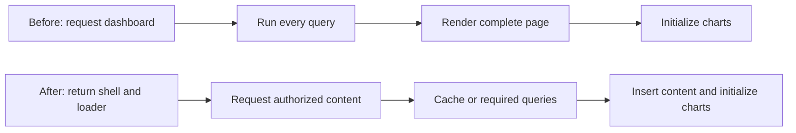

# Release Notes: Base IMIS v2.0.2 - Dashboard and Login Optimization

**Status:** Draft for technical review and production QA<br>
**Branch:** `v2.0.2-dashboard-login-optimization`<br>
**Release tag:** `v2.0.2` after approval<br>
**Related Jira:** `BASEIMIS-20`

## Release summary

This release improves dashboard loading and login feedback. Login now displays a signing-in state and blocks duplicate valid submissions. The Main, Building, and Utility dashboards return a lightweight shell first and retrieve authorized dashboard content asynchronously. The Main Dashboard also uses authorization-scoped caching with controlled stale refresh and invalidation.

VAPT login rate limiting, clickjacking protection, and password-reset enumeration remediation are not part of this release.

## User-facing changes

- Login displays a spinner and **Signing in...** while the request is active.
- The valid login form cannot be submitted repeatedly.
- Only the selected dashboard sidebar item displays a navigation loader and is temporarily locked.
- Main, Building, and Utility dashboards display **Loading dashboard data...** before content is ready.
- Dashboard loading failures display a controlled retry action.
- Expired asynchronous sessions return the user to login.
- Dynamically inserted dashboard charts initialize after their content is added.

## Before and after



## Technical implementation

| Area | Change |
|---|---|
| Main Dashboard | Shell-first response, authenticated JSON content route, scoped cache, stale refresh, refresh lock, and namespace invalidation |
| Building Dashboard | Shell-first response and removal of unrelated FSM/KPI calculations not displayed by the view |
| Utility Dashboard | Shell-first response using the shared loader; no server-side dashboard cache in this release |
| Sidebar | Selected-item loader with duplicate mouse and keyboard navigation prevention |
| Login | Disabled submit button, spinner, submitting state, and browser-history reset |
| Charts | Initializers execute correctly after asynchronous HTML insertion |

## Routes

| Method | Route | Purpose |
|---|---|---|
| GET | `/dashboard` | Main Dashboard shell |
| GET | `/dashboard/content` | Authorized Main Dashboard content |
| GET | `/building-info/buildings/buildingdashboard` | Building Dashboard shell |
| GET | `/building-info/buildings/buildingdashboard/content` | Authorized Building content |
| GET | `/utilityinfo/utilitydashboard` | Utility Dashboard shell |
| GET | `/utilityinfo/utilitydashboard/content` | Authorized Utility content |

All content routes require authentication. Content responses use `Cache-Control: private, no-store`.

## Cache design

The Main Dashboard cache key includes the namespace version, user ID, service-provider ID, treatment-plant ID, sorted roles, sorted permissions, locale, and normalized filters.

- Fresh TTL: 180 seconds by default.
- Stale retention: 1,800 seconds by default.
- A cache lock prevents duplicate refresh work.
- Relevant Eloquent save, delete, and restore events advance the namespace version.
- Direct SQL or integrations that bypass Eloquent must explicitly invalidate the dashboard cache.
- Multiple application instances should use Redis or another shared cache and lock driver.

Optional configuration:

```dotenv
DASHBOARD_CACHE_TTL_SECONDS=180
DASHBOARD_CACHE_STALE_TTL_SECONDS=1800
```

## Performance evidence

| Measurement | Before | Controlled local result |
|---|---:|---:|
| Historical complete browser dashboard | approximately 19.31 s | Production retest pending |
| Main Dashboard complete warm median | 8,625 ms | 3,142 ms |
| Main Dashboard warm report SQL | 122 statements | 0 report queries; 2 authorization queries |
| Building Dashboard median render | 931 ms / 66 queries | 185 ms / 25 queries in the initial optimized run |

These measurements are local evidence, not a production SLA. Production cold-cache, warm-cache, concurrency, network, and complete-browser measurements remain mandatory.

## Automated verification

Verified on 7 October 2026:

| Suite | Result |
|---|---:|
| `DashboardOptimizationTest` | 9 passed |
| `DashboardServiceCacheTest` | 3 passed |
| `BuildingDashboardOptimizationTest` | 3 passed |
| `UtilityDashboardLoadingTest` | 3 passed |
| **Total** | **18 passed** |

The login loader remains in the mandatory manual UI test scope. The broader workspace login test depends on separate VAPT configuration and is intentionally excluded.

## Dependencies and database impact

- Database migrations: none.
- Seeders or permission changes: none.
- New Composer packages: none.
- New NPM packages: none.
- GeoServer changes: none.

## Deployment

1. Review this branch and confirm it contains no VAPT or unrelated changes.
2. Run the focused tests and applicable full regression suite.
3. Back up the deployed application and retain the previous release tag.
4. After approval, merge through the team-approved pull-request workflow and create tag `v2.0.2` from stable `main`.
5. Deploy the approved tag and rebuild Laravel caches.

```bash
git fetch --all --tags
git checkout v2.0.2
composer install --no-dev --optimize-autoloader
php artisan optimize:clear
php artisan config:cache
php artisan route:cache
php artisan view:cache
```

Restart the applicable PHP, web, queue, or container services.

## Mandatory QA

- Verify login loading, duplicate-submit prevention, invalid-login recovery, and browser Back/Forward recovery.
- Verify the Main, Building, and Utility shell, loader, success, retry, and expired-session behavior.
- Compare all permitted totals and charts with the approved baseline.
- Test users with different roles, permissions, provider, and plant scopes.
- Prove cached HTML cannot cross users or authorization scopes.
- Test cold, warm, stale, and source-data invalidation behavior.
- Check responsive charts, browser console, Laravel logs, HTTP status codes, and production timing.

## Rollback

Check out the previous approved tag or commit, install its locked production dependencies, clear and rebuild Laravel caches, restart services, and smoke-test login and dashboard access. No database rollback is required.

## Known limitations

- Building and Utility use asynchronous loading but are not cached by the Main Dashboard cache.
- Utility query consolidation and deeper SQL optimization remain future work.
- Raw database changes bypass immediate Eloquent-driven cache invalidation.
- Dashboard widgets are returned as one asynchronous content group, not separate widget APIs.
- Production timing can differ from controlled local results.

## Commit traceability

| Commit | Purpose |
|---|---|
| `2e4ed46` | `perf(dashboard): add scoped asynchronous loading` |
| `52e7719` | `fix(auth): prevent duplicate login submissions` |
| `778f0eb` | `test(dashboard): add optimization coverage` |
| Pending | Release and technical documentation |

## Sign-off

| Role | Name | Approval | Date |
|---|---|---|---|
| Prepared by |  |  |  |
| Technical Lead |  |  |  |
| QA Lead |  |  |  |
| Project Manager / Product Owner |  |  |  |
